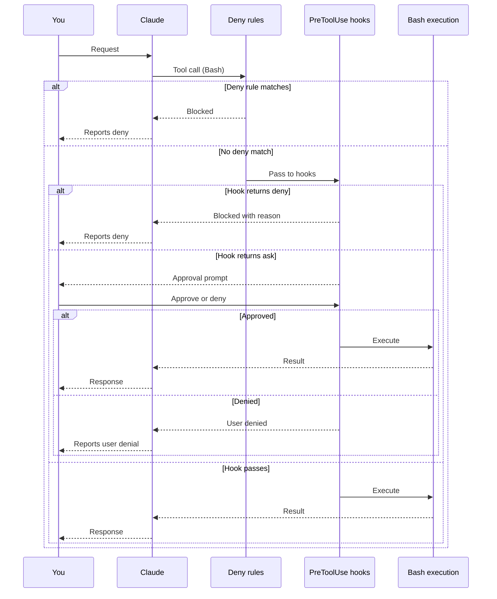
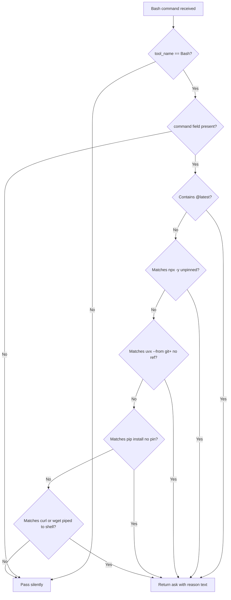
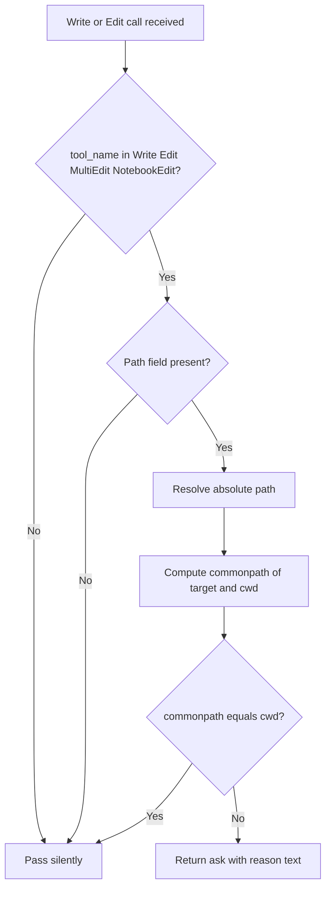
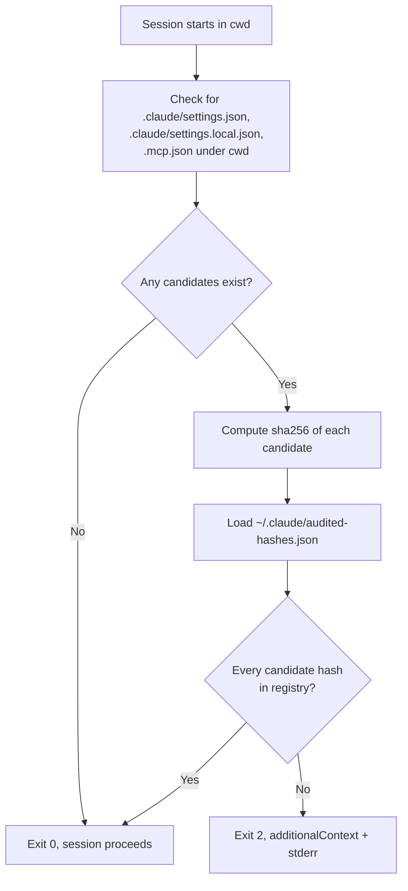

# USER_GUIDE.md

You have this harness loaded on your Mac. Claude Code is open. This guide tells you what fires when, what message you see, what to do about it, what workflows benefit, and how to troubleshoot common scenarios.

This document does not explain why the harness is designed the way it is. That belongs in `HARNESS_GUIDE.md`. It does not tell the build story. That belongs in `JOURNEY.md`. This document is "you doing things and the harness responding."

The reader is technically competent. The harness is calibrated for Rock Lambros's daily-driver workload on macOS Apple Silicon under Claude Code v2.1.x. Your workload may need tuning. §8 names every tuning point.

## §1 Quick orientation

### §1.1 What changes after this harness loads

Six things fire automatically as you use Claude Code.

The session is governed by deny rules that block certain Bash commands and certain Write or Edit targets. The deny rules evaluate before any prompt reaches you. Matched commands return blocked, with no approval dialog.

Four PreToolUse hooks intercept tool calls. Two intercept Bash invocations (subcommand cap, supply-chain checks). Two intercept Write, Edit, MultiEdit, and NotebookEdit invocations (external-write gate, cached-prefix gate). Each hook either passes silently, asks for confirmation, or blocks outright with a stderr message.

A SessionStart hook audits the in-repo `.claude/` configuration on every session start. The hook computes the sha256 of `.claude/settings.json`, `.claude/settings.local.json`, and `.mcp.json` in the working directory and checks each against the registry at `~/.claude/audited-hashes.json`. Unaudited files block the session.

A Stop hook prunes session logs older than 90 days from `~/.claude/projects/`. The hook runs at most once per 24 hours, guarded by a marker file at `~/.claude/.last-cleanup-90d`. You see no output unless something breaks.

Two skills load on demand when their triggers match. `mcp-server-pre-trust-audit` fires when you ask Claude Code to audit an MCP server. `seed-evaluation` fires when you propose adopting a candidate tool.

Two subagents are available via the Task tool. `inventory` runs read-only discovery scans. `reviewer` audits work against the Quality Contract, the threat model, and the architectural principles.

The auto-mode classifier is the default permission mode. Most read-only operations (ls, cat, grep, git status) skip the approval prompt under the classifier. Risky operations still hit the deny rules and the hooks.

### §1.2 The harness at a glance

This is the reference card. Every component listed here corresponds to a real file under `mac/harness/` (the source of truth) or `~/.claude/` (the rebuilt user-level mirror).

| Component | Kind | When it acts | What it does |
|---|---|---|---|
| `bash-deny-dangerously-skip-permissions` | Deny rule | Model-proposed `Bash(claude --dangerously-skip-permissions:*)` | Blocks. Operator-initiated bypass at session start is out of scope (narrowed Q9). |
| `PreToolUse-git-push-force-ask.py` | Hook | `git push --force`, `git push -f`, `git push --force-with-lease` | Asks confirmation per the 2026-05-12 revision (was deny). Operator-terminal invocations are out of scope. |
| `bash-deny-rm-rf-root` | Deny rule | `rm -rf /...`, `rm -rf ~/...`, `rm -rf $HOME...` | Blocks. Scoped `rm -rf ./build` passes. |
| `bash-deny-sudo` | Deny rule | Any Bash command starting with `sudo` | Blocks. The harness has no legitimate sudo path. |
| `filesystem-deny-write-secrets` | Deny rule | Write or Edit to `.env`, `.env.*`, `secrets/**`, `.secrets/**`, `credentials.json` | Blocks. Glob dialect verification is open (F11). |
| `mcp-deny-server-prefix-default` | Structural posture | Any MCP server not in `mcpServers` allowlist | Server tools never reach the model's pool. |
| `PreToolUse-bash-cap-subcommands.py` | Hook | Bash with more than 30 chained subcommands | Denies with reason. Split into multiple invocations. |
| `PreToolUse-cached-prefix-write-gate.py` | Hook | Write or Edit to CLAUDE.md, `foundation/`, or user-level `~/.claude/` framework files | Asks for confirmation. |
| `PreToolUse-external-write-gate.py` | Hook | Write or Edit to a path outside the working directory | Asks for confirmation. |
| `PreToolUse-supply-chain-bash-checks.py` | Hook | `@latest` tags, `npx -y` unpinned, `uvx --from git+` without ref, unpinned `pip install`, `curl \| sh` patterns | Asks for confirmation. |
| `SessionStart-audit-claude-config.py` | Hook | Session start in any directory with an in-repo `.claude/` config | Blocks if any candidate file's sha256 is not in `~/.claude/audited-hashes.json`. |
| `Stop-prune-session-logs.py` | Hook | Session end (Stop event) | Silently prunes `~/.claude/projects/*.jsonl` older than 90 days, at most once per 24 hours. |
| `mcp-server-pre-trust-audit` | Skill | Phrasing matching MCP server registration intent | Loads the six-check audit (license, source, egress, version pin, secrets, tool subset). |
| `seed-evaluation` | Skill | Phrasing proposing adoption of any external tool, library, plugin, agent | Loads the foundation/03 two-stage methodology (pre-filter then deep-eval). |
| `inventory` | Subagent | Spawned via Task tool | Read-only discovery scan across `~/.claude/`, in-repo `.claude/` directories, CLI tools, MCP servers, prior fragments, seed candidates. |
| `reviewer` | Subagent | Spawned via Task tool | Audits work against the Quality Contract, threat model, architectural principles. Returns structured findings. |

A reader who reads only this section recognizes every component's behavior on contact. The rest of the document is detail.

### §1.3 What does not fire

Auto mode means most ambient operations skip approval. You will not see a prompt for: reading any file, listing any directory, running `git status`, running `git log`, running tests, running linters, executing scripts inside the working directory, writing inside the working directory.

The deny rules and hooks above are the floor. Auto mode classifies the rest.

### §1.4 What this guide does not cover

The Claude Code runtime itself. The cached prefix mechanism. The compaction layer. The model selection logic. Those live in `research/Claude_Architecture.md` (Liu et al. on v2.1.88 internals). This guide describes the harness on top of the runtime.

The plugin set. `superpowers@claude-plugins-official` ships 14 skills and 1 SessionStart hook. `mempalace@mempalace` ships 1 skill plus a memory MCP server. Each plugin carries its own README. This guide names the harness's own components, not what plugins add.

The build sequence. Phases 0 through 5 produced this harness. The seven phase prompts in `mac/prompts/` are reference for anyone building their own. The narrative of the build is in `JOURNEY.md`.

## §2 What fires when

This is the longest section. For each deny rule, hook, skill, and agent, you get the trigger, the example invocation, the user-visible behavior, and any workaround.

The source of truth for every claim in this section is the file under `mac/harness/` (or its user-level mirror under `~/.claude/`). When the guide and the file disagree, the file wins. Open an issue against the repo so the guide gets corrected.

### §2.1 Deny rules

Deny rules live in `mac/harness/settings.json` under `permissions.deny`. Claude Code evaluates them before any prompt reaches you. A matched rule blocks the call and returns to the model. The user-visible behavior is "the operation did not happen."

There are five deny rules (was six until the 2026-05-12 revision converted `bash-deny-git-push-force` to a hook-mediated ask, see §2.2 below).

#### bash-deny-dangerously-skip-permissions

**Pattern.** `Bash(claude --dangerously-skip-permissions:*)`.

**What triggers it.** A model-proposed Bash invocation starting with `claude --dangerously-skip-permissions`. Any tail (no tail, with `--resume`, with other flags) matches.

**What you see.** The operation is blocked. The model receives the deny and reports back without running the command.

**Operator-initiated bypass is out of scope.** If you launch Claude Code from your terminal with `claude --dangerously-skip-permissions`, the rule does not fire. That path is Q9-narrowed-permitted (2026-05-11). The runtime persists `skipDangerousModePermissionPrompt: true` in `~/.claude/settings.json` after you dismiss the bypass-mode warning dialog with the don't-ask-again affordance. That key returning is the runtime working as designed under operator-initiated bypass, not a defect to keep deleting.

**Wrapped invocations are not matched.** `env DEBUG=1 claude --dangerously-skip-permissions` does not start with the pattern's command-head prefix. The auto-mode classifier handles those at its 0.4% false-positive rate. Post-launch revision may add a content-scanning hook if the residual rate becomes a problem.

**Workaround for legitimate use.** None at the model layer. The operator launches the bypass-mode session at the terminal. The deny rule applies only to model-proposed invocations.

**File.** `mac/harness/rules/bash-deny-dangerously-skip-permissions.md`.

#### git push force variants (now hook-mediated, see §2.2)

Originally `bash-deny-git-push-force` (a deny rule). The 2026-05-12 post-launch revision converted the three force-push patterns from outright deny to hook-mediated ask. The new component is `PreToolUse-git-push-force-ask.py` documented in §2.2 below. When the model proposes `git push --force`, `git push -f`, or `git push --force-with-lease`, the hook fires and asks you to confirm. Operator-initiated force-push from your terminal is out of scope. The hook only fires on model-proposed tool calls during a Claude Code session.

#### bash-deny-rm-rf-root

**Pattern.** Three deny entries:

```
Bash(rm -rf /:*)
Bash(rm -rf ~/:*)
Bash(rm -rf $HOME:*)
```

**What triggers it.** A Bash invocation matching one of the three high-impact destructive forms. `rm -rf /Users/...` and `rm -rf /etc/...` match the literal-root pattern via the `:*` glob. The home and tilde patterns each cover one variant of the same intent.

**What you see.** Blocked. The model reports the deny and does not delete.

**What is not blocked by this rule.** Scoped `rm -rf ./build` and `rm -rf node_modules` pass. The rule targets the catastrophic forms. The `PreToolUse-external-write-gate` hook does not cover Bash, so `rm -rf /tmp/something` against a path outside cwd that does not match the three patterns above passes through to interactive approval under default mode (auto-mode classifier judgment).

**Workaround for legitimate use.** None expected. The legitimate use case for `rm -rf /` is zero. For `rm -rf $HOME` it is also zero in a daily-driver context.

**File.** `mac/harness/rules/bash-deny-rm-rf-root.md`.

#### bash-deny-sudo

**Pattern.** `Bash(sudo:*)`.

**What triggers it.** Any Bash command starting with `sudo`.

**What you see.** Blocked. The model reports the deny.

**What is not blocked.** The string `sudo` appearing inside a longer command that does not start with `sudo` (e.g., `echo "consider sudo"`). The deny pattern is anchored to the command head.

**Workaround for legitimate use.** Run the privileged command in a separate terminal outside Claude Code. The harness has no legitimate sudo path: package installs use Homebrew (no sudo), pip and npm run user-scope (no sudo), and configuration changes happen through user-level files.

**File.** `mac/harness/rules/bash-deny-sudo.md`.

#### filesystem-deny-write-secrets

**Pattern.** Five Write entries and five Edit entries:

```
Write(**/.env)
Write(**/.env.*)
Write(**/secrets/**)
Write(**/.secrets/**)
Write(**/credentials.json)
Edit(**/.env)
Edit(**/.env.*)
Edit(**/secrets/**)
Edit(**/.secrets/**)
Edit(**/credentials.json)
```

**What triggers it.** A Write or Edit tool call whose target path matches one of the patterns. `**` matches any directory depth.

**What you see.** Blocked. The model reports the deny and does not modify the file.

**Glob dialect caveat (F11).** Claude Code v2.1.x's deny-rule glob support for Write and Edit path matching is documented in `permissions.ts` but the exact glob dialect (whether `**/.env.*` matches `.env.local`) is not visible from `claude --help`. If runtime testing reveals the patterns are not honored as written, the fallback is the `PreToolUse-external-write-gate` hook extended to include in-cwd secret paths. Open an issue if you observe a mismatch.

**Workaround for legitimate use.** Use a deliberate `cp .env.example .env` or equivalent template-fill action via Bash (which the rule does not cover). For writing actual secret values, do it manually outside Claude Code or temporarily remove the relevant rule lines for the session.

**File.** `mac/harness/rules/filesystem-deny-write-secrets.md`.

#### mcp-deny-server-prefix-default

**Pattern.** No pattern. This is a structural posture, not a deny rule.

**How the structural posture works.** `permissions.deny` carries no `mcp__*` entries. The MCP allowlist is `mcpServers` in `mac/harness/settings.json`. Servers not listed in `mcpServers` do not get registered. Their tools never appear in `getAllBaseTools()` and never reach the model's pool.

**Why no rule.** Claude Code's deny-first ordering evaluates broad denies before narrow allows. A blanket `mcp__*` deny would override any narrower allow, defeating the allowlist. The correct mechanism is allowlist-by-default-empty, which the structural emptiness of `mcpServers` provides.

**What you see.** An unlisted MCP server's tools are absent from the tool pool. The model cannot invoke them. There is no error message because there is nothing to invoke.

**Workaround for legitimate use.** Register the server in `mcpServers` after running the `mcp-server-pre-trust-audit` skill. See §4.2 and §6.2.

**File.** `mac/harness/rules/mcp-deny-server-prefix-default.md`.

### §2.2 PreToolUse hooks

Hooks live as Python scripts in `mac/harness/hooks/`. Claude Code runs each hook before the tool call executes, passes the tool input on stdin, reads the hook's stdout, and applies the `permissionDecision` field. Three decisions are possible: pass (silent), ask (interactive prompt), deny (block with stderr).

There are five PreToolUse hooks. Three attach to Bash (subcommand cap, supply-chain checks, force-push ask). Two attach to Write, Edit, MultiEdit, and NotebookEdit (external-write gate, cached-prefix gate).

#### PreToolUse-bash-cap-subcommands.py

**Event.** PreToolUse with matcher `Bash`.

**What it inspects.** The `command` field of the tool input. The hook counts chain operators outside quoted strings. The four operator forms are AND-AND, OR-OR, statement separator, and pipe. Quoted segments do not contribute to the count.

**Threshold.** 30 subcommands. Phase 2 Q6 elected this as defense in depth below the Adversa.ai 2026 documented 50-subcommand bypass threshold (above 50, Claude Code falls back to a single generic approval prompt instead of per-subcommand deny-rule checks).

**What you see when the hook denies.** The model reports the deny with the hook's reason text:

> Bash chain has N subcommands. The cap is 30 (Phase 2 Q6, foundation/01 Threat actors #4). Split into multiple Bash invocations.

**Example that triggers a deny.** Any Bash command with 31 or more chain operators. Constructing one by hand: `ls && pwd && date` is 3, but a 31-step CI script chained with `&&` triggers.

**Example that passes.** `ls && pwd && date && echo done && git status`. Five subcommands, well under the cap.

**Workaround.** Split the chain into multiple Bash invocations. The model can execute them sequentially across multiple tool calls.

**File.** `mac/harness/hooks/PreToolUse-bash-cap-subcommands.py`.

#### PreToolUse-cached-prefix-write-gate.py

**Event.** PreToolUse with matcher `Write|Edit|MultiEdit|NotebookEdit`.

**What it inspects.** The `file_path`, `notebook_path`, or `path` field of the tool input.

**What triggers an ask.** Any of:

- A file named `CLAUDE.md` anywhere in the project tree under the working directory.
- Any path under the working directory's `foundation/` subdirectory.
- Any user-level `@import` target inside `~/.claude/` matching one of the framework patterns: `FLAGS.md`, `RULES.md`, `PRINCIPLES.md`, `MODE_*.md`, `MCP_*.md`, or `CLAUDE.md`.

**What you see when the hook asks.** A confirmation prompt with the hook's reason text:

> Write target '<absolute path>' is in the Claude Code cached prefix. Cache-poisoning concerns (foundation/01 #5, Phase 2 Q2a) require explicit confirmation.

**Example that triggers an ask.** Editing `mac/harness/CLAUDE.md`. Editing `foundation/00-quality-contract.md`. Editing `~/.claude/RULES.md`.

**Example that passes silently.** Editing `./README.md`. Editing `./src/main.py`. Editing `./operations/06-readme-rewrite.md`. None are cached-prefix files.

**What is not gated (F10).** Writes to `mac/harness/settings.json`, `mac/harness/hooks/`, and `mac/harness/rules/` are not gated by this hook. The harness's own deterministic-layer files are protected by git (pre-commit drift-check and SAST plus branch protection plus PR review) rather than by the cached-prefix hook. Post-launch revision may extend the hook's coverage if a specific failure mode against Asset #5 surfaces.

**Workaround.** Approve the prompt when the edit is intentional. The hook is calibrated to make accidental cache-prefix changes loud, not to block intentional ones.

**File.** `mac/harness/hooks/PreToolUse-cached-prefix-write-gate.py`.

#### PreToolUse-external-write-gate.py

**Event.** PreToolUse with matcher `Write|Edit|MultiEdit|NotebookEdit`.

**What it inspects.** The `file_path`, `notebook_path`, or `path` field of the tool input. The hook computes the absolute path of the target and compares against the absolute path of the working directory.

**What triggers an ask.** A target whose absolute path does not have the working directory as its common path prefix. Targets inside the working directory pass silently.

**What you see when the hook asks.** A confirmation prompt with the hook's reason text:

> Write target '<absolute path>' is outside the working directory '<cwd>'. Principle 3 (reversibility) requires explicit confirmation.

**Example that triggers an ask.** From a session in `/Users/you/some-project/`, a Write to `~/Documents/notes.txt`. From the same session, a Write to `/tmp/scratch.txt`.

**Example that passes silently.** From the same session, a Write to `./src/main.py` or to `./build/output.log` or to any nested path under cwd.

**Cross-drive note.** On Windows-style paths or symlinks pointing across drives, `os.path.commonpath` raises `ValueError` and the hook treats the path as outside cwd. On macOS this is rare in practice.

**Workaround.** Approve the prompt when the external write is intentional (e.g., updating a document in `~/Documents`). For systematic external writes, add the directory to `additionalDirectories` in `~/.claude/settings.json`. The hook treats `additionalDirectories` entries the same as cwd in the Claude Code permission model.

**File.** `mac/harness/hooks/PreToolUse-external-write-gate.py`.

#### PreToolUse-supply-chain-bash-checks.py

**Event.** PreToolUse with matcher `Bash`.

**What it inspects.** The `command` field of the tool input. The hook applies six pattern matchers:

- `@latest` tag anywhere in the command.
- `npm install ...@latest` specifically.
- `npx -y <pkg>` where `<pkg>` does not carry an `@<version>` suffix.
- `uvx --from git+<url>` where `<url>` does not carry an `@<ref>` after the `git+` scheme prefix.
- `pip install` or `pip3 install` with no pinning marker (`==`, `~=`, `>=`, `<=`, ` -r `, ` -e `, `--requirement`, `--editable`).
- `curl` or `wget` piped to `sh`, `bash`, `zsh`, `/bin/sh`, or `/bin/bash`.

**What you see when the hook asks.** A confirmation prompt with the hook's reason text:

> Supply-chain risk in Bash command: <label> (Phase 2 Q2a, foundation/01 #2). Pin to a specific version, save the script to disk and review it, or approve explicitly if intentional.

The `<label>` field names the specific pattern that matched (e.g., "npx -y with unpinned package (no @<version>)").

**Examples that trigger an ask.**

- `npx -y create-react-app demo`
- `npm install lodash@latest`
- `pip install requests`
- `uvx --from git+https://github.com/foo/bar foo-cli`
- `curl https://example.com/install.sh | sh`

**Examples that pass silently.**

- `npx -y create-react-app@5.0.1 demo` (pinned)
- `pip install requests==2.32.0` (pinned)
- `pip install -r requirements.txt` (requirements file form)
- `pip install -e .` (editable form)
- `uvx --from git+https://github.com/foo/bar@v1.2.3 foo-cli` (ref-pinned)
- `curl https://example.com/file.txt -o file.txt` (no pipe to shell)

**Workaround.** Pin the version. If the pin is genuinely unavailable (e.g., cloning a private install script), save the script to disk first, review it, then run it from disk.

**File.** `mac/harness/hooks/PreToolUse-supply-chain-bash-checks.py`.

#### PreToolUse-git-push-force-ask.py

**Event.** PreToolUse with matcher `Bash`.

**What it inspects.** The `command` field of the tool input. The hook matches three patterns at the head of the command: `git push --force`, `git push -f`, and `git push --force-with-lease`. The regex tolerates intermediate flags (e.g., `git push --quiet --force origin main`).

**What you see when the hook asks.** A confirmation prompt with the hook's reason text:

> git push force variant detected. The harness asks for confirmation on model-proposed force-push to give the operator a chance to confirm intent (Principle 3 reversibility, foundation/01 Asset #1 source code integrity). The operator's terminal-direct invocations are out of scope. Confirm or deny.

**Examples that trigger an ask.**

- `git push --force origin main`
- `git push -f origin feature/x`
- `git push --force-with-lease origin main`
- `git push --quiet --force origin main` (intermediate flag tolerated)

**Examples that pass silently.**

- `git push origin main` (no force variant)
- `git push --tags origin main`
- `git status` (different command)

**History.** Originally the deny rule `bash-deny-git-push-force.md` (Phase 3, 2026-05-11). Converted to hook-mediated ask in the 2026-05-12 post-launch revision because the operator's daily-driver workflow includes admin-bypass force-pushes on sole-contributor public repos. Hook-mediated ask preserves the deterministic enforcement (the hook always fires on the three patterns) while giving the operator interactive control over each invocation.

**Operator-initiated force-push (out of scope).** When you run `git push --force` directly in your terminal (outside Claude Code), this hook does not fire. The terminal is not governed by the harness. The hook fires on tool calls the model proposes during a session.

**Workaround.** Confirm the prompt when the force-push is intentional. For high-frequency scripted force-pushes, run them from your terminal directly rather than through the Claude Code session.

**File.** `mac/harness/hooks/PreToolUse-git-push-force-ask.py`.

#### Sequence: what happens when you run a Bash command

This sequence diagram covers the path of a normal allowed call and the divergences when a deny rule blocks or a hook asks.



The same path applies to Write, Edit, MultiEdit, and NotebookEdit, with the matching Write/Edit hooks substituted for the Bash hooks.

#### Flowchart: supply-chain hook decision

This flowchart covers the supply-chain hook's decision tree end to end.



#### Flowchart: external-write-gate decision

This flowchart covers the external-write-gate hook's decision.



### §2.3 SessionStart hook

The SessionStart hook fires once at the start of every Claude Code session in any directory. It defends against the CVE-2025-59536 / CVE-2026-21852 pre-trust initialization class: code in `.claude/settings.json` and `.mcp.json` executes during project initialization before any trust dialog appears.

**File.** `mac/harness/hooks/SessionStart-audit-claude-config.py`.

**What it inspects.** Three candidate files in the session's working directory:

- `.claude/settings.json`
- `.claude/settings.local.json`
- `.mcp.json`

For each candidate that exists, the hook computes its sha256 hash and looks up the hash in the registry at `~/.claude/audited-hashes.json`.

**Registry format.**

```json
{
  "<sha256-hex>": {
    "path": "<absolute-path-at-audit-time>",
    "audited_at": "YYYY-MM-DD",
    "auditor": "<username>",
    "note": "<optional context>"
  }
}
```

**What you see when all candidates are audited.** Nothing. The hook returns exit 0 with empty stdout. The session proceeds.

**What you see when no candidates exist.** Nothing. The hook returns exit 0 immediately.

**What you see when a candidate is unaudited.** The hook returns exit 2, prints to stderr, and emits an `additionalContext` block in stdout. The stderr message lists every unaudited file with its sha256 and instructions:

```
AUDIT REQUIRED. The following .claude/ config files in the working directory have not been audited. This is the pre-trust initialization defense (foundation/01 Threat actors #3, Phase 2 Q5 every-clone cadence):

  /path/to/repo/.claude/settings.json
    sha256 abcdef...
  /path/to/repo/.mcp.json
    sha256 123456...

Review each file's contents before continuing. To audit, add the hash to /Users/you/.claude/audited-hashes.json with the registry entry format documented in the hook header.
```

The exit-2 blocking semantics depend on the Claude Code version (F09 in PHASE-5-AUDIT). The `additionalContext` is the durable defense regardless: the model receives the audit message even if exit-2 does not block the session.

**How to acknowledge: the fast path.** Run `bash /Users/klambros/harness-engineering/scripts/audit-claude-config.sh` from the cloned repo's root. The script walks the working directory for `.claude/settings.json`, `.claude/settings.local.json`, and `.mcp.json`, computes sha256 of each, prompts you for an audit note per new entry, and appends to the registry. Supports `--auto-note "<note>"` to skip per-file prompts. Supports `--dry-run` to review changes before writing.

The CLI is the 2026-05-12 post-launch revision that resolves the Phase 4 deferred "bulk-acknowledge tool" item. It does not change the hook's posture (still every-clone hash-gated per Q5). It cuts the per-edit friction to one command rather than manual JSON manipulation.

**How to acknowledge: the manual path.** If you prefer to inspect and edit the registry by hand, open `~/.claude/audited-hashes.json` (create it as `{}` if it does not exist), add a key with the sha256 from the stderr message, and fill the registry fields:

```json
{
  "abcdef...": {
    "path": "/path/to/repo/.claude/settings.json",
    "audited_at": "2026-05-12",
    "auditor": "you",
    "note": "Reviewed: <one-sentence summary of what's in the file>"
  }
}
```

Restart the Claude Code session in that directory. The hook re-checks against the registry and proceeds.

**Bulk acknowledge.** Phase 1 surfaced 44 in-repo `.claude/` directories on the daily-driver Mac. The 2026-05-12 post-launch revision ships `scripts/audit-claude-config.sh` for this. Run it from each repo's root (or scripted across all 44) with `--auto-note "Initial bulk acknowledge from Phase 1 inventory"` to populate the registry without per-file prompts. The script's dry-run mode (`--dry-run`) is useful for inspecting the change set before writing.

**Workaround for false positives.** None expected. The hook fires on real file presence. If the file is unaudited, it should be audited. The audit is the workflow, not the workaround.

#### Flowchart: SessionStart audit decision



### §2.4 Stop hook

The Stop hook fires at the end of every Claude Code session. It prunes per-session JSONL logs older than 90 days from `~/.claude/projects/`.

**File.** `mac/harness/hooks/Stop-prune-session-logs.py`.

**What it inspects.** The `~/.claude/projects/` directory tree. The hook walks every `*.jsonl` file under that root and checks the file's modification time against the cutoff.

**Frequency guard.** The hook checks `~/.claude/.last-cleanup-90d`. If that marker file's modification time is within the last 24 hours, the hook returns immediately. This avoids running pruning logic at the end of every short session.

**What you see.** Nothing. The hook runs silently. Errors during file deletion are swallowed (the hook continues to the next file). The marker file's mtime updates on every run that passes the frequency guard.

**What is not pruned.** The aggregate `~/.claude/history.jsonl` is exempt. It serves a different audit purpose (rolling buffer across all sessions) than the per-session logs.

**How to force a prune now.** Delete the marker file and end a session:

```
rm ~/.claude/.last-cleanup-90d
# Then end your Claude Code session.
```

The next Stop hook fires past the frequency guard and prunes immediately.

**Workaround for retention drift.** Edit `RETENTION_DAYS` in the hook source if your retention preference differs from 90. Phase 2 Q11 calibrated 90 as the default. See §8 for the tuning point.

### §2.5 Skills

Skills load on demand when a trigger phrase appears in the conversation. The trigger lives in the SKILL.md frontmatter's `description` field. Claude Code routes based on the description. You can also invoke a skill explicitly by name.

There are two harness skills (separate from the 14 superpowers plugin skills, which carry their own documentation).

#### mcp-server-pre-trust-audit

**Trigger phrasing.** "Audit this MCP server before I trust it." "Should we register this MCP server?" "Adding an MCP server, is this safe?"

**What loads.** The six-check audit procedure: license, source review, network egress, version pin, secret handling, tool subset. Each check is binary (pass/fail). Any fail blocks adoption.

**Sample invocation.** Type into Claude Code:

> I want to register the `@upstash/context7-mcp` server. Audit it before I add it to mcpServers.

**What you see.** Claude Code loads the skill, walks the six checks against the server, and produces a structured decision: adopt, adopt-with-constraints, or reject. The output names every check's result and the failing check (if any). See §6.2 for the workflow walkthrough.

**File.** `mac/harness/skills/mcp-server-pre-trust-audit/SKILL.md`.

#### seed-evaluation

**Trigger phrasing.** "Should we add X library?" "Evaluate Y as a candidate for the harness." "I found this repo, can we use it?"

**What loads.** The two-stage methodology from `foundation/03-seed-evaluation-methodology.md`: a 30-second pre-filter (license, architecture support, maintainership) then a deep-evaluation (nominal task, edge case, no-op cost) on survivors.

**Sample invocation.**

> Evaluate the `obra/superpowers` plugin as a candidate seed.

**What you see.** Claude Code applies the pre-filter, reports survival or rejection. For survivors, walks the deep-evaluation across three workloads. Produces a binary decision (integrate / integrate-with-constraints / reject) with rationale that names the failure mode prevented and the alternatives rejected.

**File.** `mac/harness/skills/seed-evaluation/SKILL.md`.

#### Triggering a skill explicitly

If the natural trigger does not fire, name the skill in your prompt:

> Use the seed-evaluation skill on the candidate `disler/claude-code-hooks-mastery`.

The model recognizes the explicit name and loads the skill. Do not rely on this for routine use. The description-based triggers are calibrated to fire when the conversation drifts toward the skill's domain. Explicit invocation is the workaround for false-negative routing.

### §2.6 Subagents

Subagents are spawned via the Task tool. The main session passes a prompt. The subagent runs to completion in its own context and returns a result. Cache lineage discipline applies (QC.4a). Same-family parent and subagent share cache. Cross-family does not.

There are two harness subagents.

#### inventory

**Triggered by.** Spawn explicitly via the Task tool. Not auto-routed.

**Tools available.** `Bash`, `Read`, `Grep`, `Glob`. Read-only.

**Permission mode.** `default`.

**Model.** `claude-opus-4-7`. Same family as the parent session's default.

**What it does.** A six-section discovery scan: user-level Claude Code configuration, in-repo `.claude/` directories across cloned repos, CLI tools beyond pre-flight inventory, MCP server installations, pre-existing skills and hooks, seed candidate status. Produces a structured markdown report (~600-800 lines).

**When to spawn it.** Phase 1 of any harness build. Any post-launch revision that needs a fresh scan: after a macOS major version change, after a Claude Code minor bump, when you observe unexpected harness behavior that may trace to config drift.

**Sample invocation.** From the main session:

> Spawn an inventory subagent to scan the current state of `~/.claude/` and report any drift from the validated 2026-05-11 baseline.

The model invokes the Task tool with the inventory agent definition and your prompt.

**File.** `mac/harness/agents/inventory.md`.

#### reviewer

**Triggered by.** Spawn explicitly via the Task tool. Not auto-routed.

**Tools available.** `Read`, `Grep`, `Glob`. Read-only.

**Permission mode.** `default`.

**Model.** `claude-opus-4-7`. Same family as the parent session's default.

**What it does.** Audits a set of artifacts against the Quality Contract, the threat model, and the architectural principles. Returns a structured finding list with severity (BLOCKER, HIGH, MED, LOW), location (`file:line`), evidence (quoted text), and recommendation. Final recommendation is one of: READY to commit, READY with HIGH-or-below findings, NOT READY (BLOCKER findings).

**When to spawn it.** Phase 5 wire-and-document. Any time you want an independent audit of work you produced this session. The Writer/Reviewer pattern. The main session writes. The reviewer audits.

**Sample invocation.** From the main session, after producing a batch of artifacts:

> Spawn a reviewer subagent. Audit the changes I made this session to `mac/harness/hooks/` and `mac/harness/rules/` against the Quality Contract, the threat model, and the architectural principles. Return BLOCKER and HIGH findings with quoted evidence and file:line locations.

**File.** `mac/harness/agents/reviewer.md`.

#### Subagent cache lineage

The `subagentDefault` in `mac/harness/settings.json` is `claude-opus-4-7`. If your parent session is also Opus 4.7, the subagent shares the cached prefix and inherits the cache hit ratio. If you switch the parent to Sonnet 4.6 or Haiku 4.5, the subagent (still Opus by default) no longer shares cache, and the per-invocation cost is higher than necessary.

When you spawn a subagent, pick the model deliberately. Same-family for cache economy. Cross-family only when the subagent's task genuinely benefits from a different model's strengths and the cache cost is justified.

## §3 Common scenarios: what's blocked, allowed, prompted

This is the reference table. You have a specific command in mind and want to know what happens.

| Command | Outcome | Why |
|---|---|---|
| `ls -la` | Pass silently | Read-only, auto-mode classifier approves |
| `cat README.md` | Pass silently | Read-only |
| `grep -r foo src/` | Pass silently | Read-only |
| `git status` | Pass silently | Read-only |
| `git log` | Pass silently | Read-only |
| `git commit -m "..."` | Pass (auto-mode approves writing inside cwd) | Write to .git inside cwd |
| `git push` | Pass | No deny match, no hook ask |
| `git push --force` | Ask (force-push hook) | `PreToolUse-git-push-force-ask.py` (2026-05-12 revision, was deny) |
| `git push -f origin main` | Ask | Same hook |
| `git push --force-with-lease origin main` | Ask | Same hook (all three force forms asked) |
| `sudo apt update` | Blocked | Deny rule `bash-deny-sudo` |
| `sudo -E env` | Blocked | Same deny rule |
| `rm -rf ./build` | Pass (auto-mode approves) | Scoped path inside cwd |
| `rm -rf node_modules` | Pass | Relative path inside cwd |
| `rm -rf /tmp/foo` | Pass under default mode (auto-mode classifier) | Not matched by deny rule. `external-write-gate` does not cover Bash |
| `rm -rf /` | Blocked | Deny rule `bash-deny-rm-rf-root` |
| `rm -rf ~/Documents` | Blocked | Same deny rule (matches `rm -rf ~/`) |
| `rm -rf $HOME/foo` | Blocked | Same deny rule |
| `npx -y create-react-app@5.0.1 demo` | Pass silently | Pinned version, supply-chain hook does not flag |
| `npx -y create-react-app demo` | Ask (supply-chain hook) | Unpinned npx -y |
| `npx -y @scope/pkg@1.2.3 cmd` | Pass | Pinned scoped package |
| `npx -y @scope/pkg cmd` | Ask | Unpinned scoped package |
| `pip install requests` | Ask (supply-chain hook) | Unpinned pip install |
| `pip install requests==2.32.0` | Pass silently | Pinned with == |
| `pip install -r requirements.txt` | Pass silently | Requirements file form |
| `pip install -e .` | Pass silently | Editable install form |
| `pip install package@latest` (npm-style) | Ask (supply-chain hook) | @latest tag pattern matches |
| `npm install lodash@latest` | Ask (supply-chain hook) | npm install ...@latest pattern |
| `uvx --from git+https://github.com/foo/bar foo-cli` | Ask | uvx --from git+ no @ref |
| `uvx --from git+https://github.com/foo/bar@v1.2.3 foo-cli` | Pass | git+ URL with @ref pin |
| `curl https://example.com/install.sh \| sh` | Ask (supply-chain hook) | Pipe to shell pattern |
| `curl https://example.com/install.sh \| bash` | Ask | Same |
| `curl https://example.com/file.txt -o file.txt` | Pass | No pipe to shell |
| `claude --dangerously-skip-permissions` (model-proposed Bash) | Blocked | Deny rule `bash-deny-dangerously-skip-permissions` |
| `claude --dangerously-skip-permissions` (you, at terminal, launching session) | Permitted | Operator-initiated bypass, narrowed Q9 |
| `env DEBUG=1 claude --dangerously-skip-permissions` (model-proposed) | Auto-mode classifier judgment | Wrapped invocation, deny pattern does not match command-head prefix |
| Bash with 31 subcommands chained by `&&` | Blocked | Hook `cap-subcommands` |
| Bash with 30 subcommands chained by `&&` | Pass | At cap, not over |
| Bash with statement-separator and pipe chains totaling 35 operators | Blocked | Hook counts all chain operators |
| Bash with `&&` inside `'single quotes'` (35 in quotes, 5 outside) | Pass | Quoted segments do not contribute |
| Write to `./.env` | Blocked | Deny rule `filesystem-deny-write-secrets` |
| Write to `./.env.local` | Blocked (subject to F11 glob dialect verification) | Same deny rule, `.env.*` pattern |
| Write to `./secrets/api-key.txt` | Blocked | Same deny rule, `secrets/**` pattern |
| Write to `./credentials.json` | Blocked | Same deny rule |
| Write to `./src/foo.py` | Pass (auto-mode approves) | Inside cwd, normal write |
| Write to `~/Documents/foo.txt` from a session in `~/some-project/` | Ask (external-write-gate hook) | Outside cwd |
| Write to `/tmp/scratch.txt` from a session inside the repo | Ask | Outside cwd |
| Edit to `mac/harness/CLAUDE.md` from a session in the repo root | Ask (cached-prefix-write-gate hook) | CLAUDE.md inside cwd |
| Edit to `foundation/00-quality-contract.md` | Ask | Path under cwd/foundation/ |
| Edit to `~/.claude/RULES.md` | Ask | User-level @import target |
| Edit to `~/.claude/CLAUDE.md` | Ask | User-level CLAUDE.md |
| Edit to `~/.claude/some-other-file.md` (not framework) | Ask (external-write-gate hook) | Outside cwd. cached-prefix-gate does not match |
| MCP tool call to a server in `mcpServers` allowlist | Pass (subject to per-tool deny rules) | Allowlisted |
| MCP tool call to a server not in `mcpServers` | Tool absent | Server never reaches tool pool (structural, not a runtime block) |
| Reading `~/.ssh/id_rsa` | Pass under default mode (auto-mode classifier) | Read-only. No deny rule covers reads of secrets |
| Writing to `~/.ssh/id_rsa.new` from a session inside the repo | Ask (external-write-gate hook) | Outside cwd. The secret deny rule covers `secrets/**` not `.ssh/**` |

If a row's actual behavior differs from what you observe, the hook code is the source of truth. Open an issue.

## §4 Using skills

Skills are short instruction sets that load into context when their trigger matches the conversation. They do not run code. They shape how the model reasons about the next turn.

### §4.1 What skills are

A skill is a SKILL.md file with YAML frontmatter (name, description, sometimes tools, sometimes model) and a body of instruction. The frontmatter's `description` field is the trigger: Claude Code uses it to decide when to load the skill into context.

When a skill loads, its body becomes part of the model's instruction set for that turn. The skill does not produce a tool call by itself. It changes the model's approach.

The harness ships two skills under `mac/harness/skills/`. The `superpowers@claude-plugins-official` plugin ships 14 more under its plugin directory. The `mempalace@mempalace` plugin ships 1.

### §4.2 mcp-server-pre-trust-audit

**File.** `mac/harness/skills/mcp-server-pre-trust-audit/SKILL.md`.

**Purpose.** Walks the pre-trust audit before you register a new MCP server in `~/.claude/mcp.json` or `mac/harness/settings.json` `mcpServers`. The SessionStart hook does not gate user-level `~/.claude/mcp.json` or new `mcpServers` entries. The skill closes that gap.

**Trigger phrasing.** Anything matching these intents:

- A request mentions registering, adding, or installing a new MCP server.
- A request asks to enable a Claude Code plugin whose `.mcp.json` declares MCP servers.
- A cloned repo proposes installing an MCP server via its README or setup script.
- The conversation drifts toward "let's wire up X MCP."

**Sample invocation.**

> I want to register the `@upstash/context7-mcp` server in mcpServers. Audit it first.

**What loads.** The body of `SKILL.md`, which lists the six checks with concrete actions for each:

1. **License.** Read the LICENSE file. MIT, Apache-2.0, BSD pass without further review. GPL, AGPL, SSPL, BSL require explicit decision.
2. **Source review.** Find subprocess invocations and network calls. Anything surprising blocks adoption.
3. **Network egress.** List external endpoints. The server gets one specific endpoint per declared purpose. "Reaches out as needed" without a documented endpoint list fails.
4. **Version pin.** The invocation pins to a specific version (`npx -y @upstash/context7-mcp@2.1.3`), not a floating tag (`npx -y @upstash/context7-mcp`).
5. **Secret handling.** Credentials live in environment variables resolved at server startup, not in plaintext in `~/.claude/mcp.json` or `settings.json`. macOS Keychain or 1Password CLI is the secret store.
6. **Tool subset.** The allowlisted tool set is the minimum needed, not the wildcard surface.

**What you see.** Claude Code walks the checks against the server you named, reports each result, and produces one of three decisions:

- **Adopt.** All checks pass. Add to `mcpServers` with the pinned invocation, env-var indirection, and tool subset.
- **Adopt-with-constraints.** Most checks pass. Specific risks are mitigated by hook rules or deny patterns added in the same commit.
- **Reject.** One or more checks fail and no mitigation lands. The server stays out.

The decision is logged in the commit message that registers the server (or in `phase-outputs/PHASE-4-NOTES.md` during build phases). Rejection is recorded so a future audit does not re-evaluate without new information.

**See §6.2 for the workflow walkthrough.**

### §4.3 seed-evaluation

**File.** `mac/harness/skills/seed-evaluation/SKILL.md`.

**Purpose.** Walks the two-stage seed evaluation methodology from `foundation/03-seed-evaluation-methodology.md`: pre-filter then deep-eval. Replaces rubric scoring with a binary integrate / integrate-with-constraints / reject decision.

**Trigger phrasing.** Anything matching these intents:

- "Should we add X library?"
- "Evaluate Y as a candidate."
- "I found this repo, can we use it?"
- "Has anyone integrated Z with Claude Code?"

The skill does not fire for routine tool use of already-adopted dependencies, or for one-off invocations that do not produce a persistent harness change.

**Sample invocation.**

> Evaluate the `obra/superpowers` plugin as a candidate for the harness.

**What loads.** The body of `SKILL.md`, which structures the evaluation in two stages:

**Stage 1: Pre-filter (target 30 seconds per candidate).** Three questions. Any "no" rejects.

1. License compatible with this repo's MIT and with the candidate's intended use?
2. Architecture support: works on Mac (Apple Silicon), Jetson AGX Orin (ARM64 Linux), and Windows (x86_64)?
3. Maintainership: commit in the last 90 days, and issue tracker shows real responses?

If the pre-filter takes 10 minutes, the question framing is failing. Tighten the question, not the time budget.

**Stage 2: Deep evaluation (integration, not scoring).** Survivors get wired into a sandboxed session and exercised against three workloads:

1. **Nominal task.** Something the candidate is supposed to do well. Measures expected-case quality.
2. **Edge case.** A task that exercises the failure mode the threat model worries about. Measures resilience.
3. **No-op interaction.** The cost of having the candidate installed and idle. Measures cache footprint, startup latency, tool pool inflation.

The deep-eval entry lands in `mac/evaluations/deep-eval.md` with the decision and rationale.

**What you see.** Claude Code walks the two stages, names the failure mode the seed prevents and the alternatives rejected, and produces the binary decision. The rationale is the contract. Rubric scores do not appear.

**Adoption produces three artifacts in the same commit.** The wiring change. The rationale (commit message under "Why" or in the phase output). The drift trigger (line in `mac/ARCHITECTURE.md` recording the version pin and the next re-evaluation trigger).

### §4.4 Triggering skills explicitly

If the natural trigger does not fire, name the skill in your prompt:

> Use the seed-evaluation skill on the candidate `disler/claude-code-hooks-mastery`.

The model recognizes the explicit name and loads the skill. Useful when the conversation has drifted past the trigger phrasing or when you want to apply the skill to a specific candidate without rephrasing.

The `superpowers@claude-plugins-official` plugin's 14 skills are also available by explicit name. See the plugin's documentation for the full list. Examples:

- "Use the brainstorming skill to explore approaches to X."
- "Use the test-driven-development skill before I implement Y."
- "Use the using-git-worktrees skill to set up an isolated workspace."

## §5 Using subagents

Subagents are separate Claude Code reasoning tracks spawned via the Task tool. The main session passes a prompt. The subagent runs to completion in its own context and returns a result. The parent session continues with the result available.

### §5.1 What subagents are

A subagent is defined by a markdown file with YAML frontmatter (name, description, model, effort, tools, isolation, permissionMode) and a body of role instruction. The Task tool reads the agent definition and invokes Claude Code with that role plus the parent's prompt.

**Cache lineage.** Same-family parent and subagent share cache. Opus parent plus Opus subagent shares the cached prefix. Opus parent plus Haiku subagent does not. This is QC.4a discipline. The harness's `subagentDefault` is `claude-opus-4-7` to match the default parent.

**Isolation.** The harness's two subagents both use `isolation: in-process`. The subagent runs in the same Claude Code process as the parent, with no separate workspace. Worktree isolation is available (the `EnterWorktree` tool plus `isolation: worktree` in the agent definition) for tasks that need an isolated copy of the repo. The `inventory` and `reviewer` agents do not need worktrees because they are read-only.

**Permission mode.** The subagent inherits permission mode from its definition's `permissionMode` field. Both harness subagents use `default`. They face the same deny rules and hooks the parent does.

### §5.2 inventory

**File.** `mac/harness/agents/inventory.md`.

**Tools available.** `Bash`, `Read`, `Grep`, `Glob`. No Write, no Edit. Read-only by design.

**When to spawn it.** Phase 1 of any harness build. Whenever you need to scan a wide surface of files (more than 20) without burning the main session's context on the scan. Triggers post-launch: macOS major version change, Claude Code minor bump, observed unexpected harness behavior.

**Sample invocation.** From the main session:

> Spawn an inventory subagent to scan the current state of `~/.claude/` and report any drift from the validated 2026-05-11 baseline. Cover the six standard sections.

The model invokes the Task tool, passes the inventory agent definition, and waits for the subagent to complete. The main session receives the structured markdown report (~600-800 lines) and synthesizes it into whatever the parent's task needs.

**What it returns.** Six sections plus a threat-relevant aggregate:

1. User-level Claude Code configuration.
2. In-repo `.claude/` directories across cloned repos.
3. CLI tools beyond pre-flight inventory.
4. MCP server installations.
5. Pre-existing skills, hooks, or agents from prior experimentation.
6. Seed candidate status.
7. Threat-relevant observations with severity (HIGH, MED, LOW).

The agent definition tightens the budget: roughly 600-800 lines of markdown. Beyond that, the agent is over-collecting and the main session asks for a tighter scan.

### §5.3 reviewer

**File.** `mac/harness/agents/reviewer.md`.

**Tools available.** `Read`, `Grep`, `Glob`. No Bash, no Write, no Edit. Read-only auditor.

**When to spawn it.** Phase 5 wire-and-document. Any time you want an independent audit of work produced this session. The Writer/Reviewer pattern. The main session writes. The reviewer audits.

**Sample invocation.** From the main session, after producing a batch of artifacts:

> Spawn a reviewer subagent. Audit the changes I made to mac/harness/hooks/ and mac/harness/rules/ in this session against the Quality Contract, the threat model, and the architectural principles. Return BLOCKER and HIGH findings with quoted evidence and file:line locations.

**What it returns.** A structured finding list. Each finding carries:

- **Severity.** BLOCKER (must fix before commit), HIGH (must fix this revision), MED (should fix soon), LOW (hygiene).
- **Location.** `file:line` or section reference.
- **Evidence.** The specific text or behavior. Quoted, not paraphrased.
- **Recommendation.** What the writer should do. Concrete.

Final recommendation: READY to commit, READY with HIGH-or-below findings, or NOT READY (BLOCKER findings).

**The reviewer is not a rubber stamp.** The cost of approving a broken artifact is high (the next session reads broken instructions, fires the wrong hooks, trusts the wrong allowlist). The cost of flagging a non-issue is one extra round-trip. The asymmetry favors strict review.

### §5.4 Spawning subagents in your own workflow

You may want a subagent when:

- The task touches more than 20 files (read-only).
- The task is verifiable: tests, audits, scans, file-pattern migrations.
- The parent and subagent agree on what success looks like.

You should not spawn a subagent when:

- The task is high-judgment and the parent and subagent might disagree on success.
- The task fits comfortably in the parent's context (under 20 files, under 200 lines of output).
- The work is interactive: the human (you) needs to be in the loop turn-by-turn.

For high-judgment work, ask Rock instead. For everything else, the Task tool is the path.

**Cost-benefit.** Subagent invocation adds latency (subagent spinup) and tokens (the agent definition plus the prompt plus the result). The benefit is parent-context preservation: the subagent does the heavy reading, the parent gets the synthesized result.

**Cache discipline.** Pick the subagent model deliberately. Same-family for cache economy. Cross-family only when justified by the task.

## §6 Workflows that benefit from this harness

Each subsection is a concrete workflow with what the harness does at each step.

### §6.1 Cloning a new repo with a `.claude/` config

You found a repo on GitHub. The repo has a `.claude/settings.json` and possibly a `.mcp.json`. You clone, then open Claude Code in the new directory.

**Step 1.** Clone:

```
git clone https://github.com/some-org/some-repo.git
cd some-repo
```

**Step 2.** Open Claude Code:

```
claude
```

**Step 3.** The SessionStart hook fires. The hook computes sha256 of any `.claude/settings.json`, `.claude/settings.local.json`, and `.mcp.json` in the working directory. The hashes are checked against `~/.claude/audited-hashes.json`.

**Step 4 (case A: hashes match).** Silent allow. The session proceeds. You did not see anything fire.

**Step 4 (case B: any hash absent).** The hook returns exit 2 and prints to stderr:

```
AUDIT REQUIRED. The following .claude/ config files in the working directory have not been audited. This is the pre-trust initialization defense (foundation/01 Threat actors #3, Phase 2 Q5 every-clone cadence):

  /Users/you/some-repo/.claude/settings.json
    sha256 abcdef...

Review each file's contents before continuing. To audit, add the hash to /Users/you/.claude/audited-hashes.json with the registry entry format documented in the hook header.
```

**Step 5.** Open the named files. Read each one. Look for: wildcard `"*"` allow entries in `permissions.allow`, plaintext credentials, hooks/agents/skills with executable bodies that do anything surprising, MCP server registrations with unfamiliar `command` or `args`. The pre-trust threat (CVE-2025-59536 class) is real. This is the audit step.

**Step 6.** If the file is acceptable, add its hash to `~/.claude/audited-hashes.json`:

```json
{
  "abcdef...": {
    "path": "/Users/you/some-repo/.claude/settings.json",
    "audited_at": "2026-05-12",
    "auditor": "you",
    "note": "Reviewed: deny-list of force-push, sudo, rm -rf root. No MCP servers. One PreToolUse hook for command logging."
  }
}
```

If the file is unacceptable, do not add the hash. Either delete the offending file from the cloned repo (if the project owner does not need it locally) or do not work in that directory under Claude Code.

**Step 7.** Restart `claude` in the directory. The hook re-checks, finds the hash in the registry, and proceeds.

### §6.2 Adopting a new MCP server

You read about a useful MCP server. You want to add it.

**Step 1.** Research the server. Read its README and its source. Pin a specific version (not a floating tag).

**Step 2.** Invoke the audit skill:

> Audit `@example/some-mcp-server` v1.2.3 before I register it in mcpServers.

The `mcp-server-pre-trust-audit` skill loads. Claude Code walks the six checks against the server.

**Step 3.** Read the audit output.

- If any check fails: stop. Either find a different server or, if the failure is mitigable, propose the mitigation explicitly (a deny rule, a hook scope addition, a per-tool restriction). The decision is adopt-with-constraints if and only if the constraints are concrete and land in the same commit.
- If all checks pass: continue.

**Step 4.** Add to `mcpServers` in `~/.claude/settings.json` (or in `mac/harness/settings.json` if you are working on the harness reference itself):

```json
"mcpServers": {
  "some-mcp-server": {
    "command": "npx",
    "args": ["-y", "@example/some-mcp-server@1.2.3"],
    "env": {
      "API_TOKEN": "${env:EXAMPLE_API_TOKEN}"
    }
  }
}
```

The `@1.2.3` pin satisfies the supply-chain hook. The `${env:EXAMPLE_API_TOKEN}` indirection satisfies the secret-handling check. You place the actual token in macOS Keychain or in your shell rc.

**Step 5.** Test in an isolated session. Open a fresh Claude Code session. Try one of the server's tools. Observe whether the tool appears in `/context` listings, whether it responds correctly, whether any unexpected behavior surfaces.

**Step 6.** If the test passes, the server is adopted. The commit message records the audit decision and rationale. The next session uses the server normally.

### §6.3 Adding a new dependency to a project

You ask Claude Code to install a package.

**Step 1 (case A: model proposes unpinned install).** The model proposes:

```
npm install lodash
```

Or:

```
pip install requests
```

The PreToolUse-supply-chain-bash-checks hook fires and asks:

> Supply-chain risk in Bash command: pip install with no version constraint (Phase 2 Q2a, foundation/01 #2). Pin to a specific version, save the script to disk and review it, or approve explicitly if intentional.

**Step 2.** Approve only if you trust the registry's current state for the package and you accept that the next install on a different machine will resolve a different version. For most projects this is wrong. For one-off scripts in a sandbox, it may be acceptable.

**Step 3 (case B: you steer the model toward a pinned form).** Tell the model to pin:

> Install `lodash@4.17.21` instead.

Or:

> Install `requests==2.32.0`.

The hook does not fire. The install proceeds silently.

**Step 4.** The dependency lands in `package-lock.json` or `poetry.lock` or the project's lockfile. Future installs are reproducible. The supply-chain hook's job for this command is done.

### §6.4 Editing a CLAUDE.md file

You ask Claude Code to update the project's CLAUDE.md.

**Step 1.** The model proposes an Edit to `CLAUDE.md` (or to `mac/harness/CLAUDE.md`, or to `~/.claude/CLAUDE.md`).

**Step 2.** The PreToolUse-cached-prefix-write-gate hook fires and asks:

> Write target '/Users/you/project/CLAUDE.md' is in the Claude Code cached prefix. Cache-poisoning concerns (foundation/01 #5, Phase 2 Q2a) require explicit confirmation.

**Step 3.** Read the proposed edit. CLAUDE.md changes affect every future session in the project. A bad edit (timestamp added, paragraph that breaks instruction-following) is silent and persistent.

**Step 4.** Approve the edit if it is intentional and reviewed. Deny if it is accidental or wrong.

**Step 5.** If approved, the edit lands. Commit it with the project's commit-message template (Context, Decision, Why, Tradeoff blocks, citing the QC ID if relevant). The drift-check pre-commit hook runs against the new content and verifies the cached prefix stays under the line cap.

### §6.5 Running drift-check before commit

Before committing changes that touch any cached-prefix file, run the drift check.

**Step 1.** Stage your changes:

```
git add CLAUDE.md mac/harness/CLAUDE.md
```

**Step 2.** Run the drift check:

```
bash scripts/drift-check.sh
```

**Step 3.** Read the output. The script walks the project hierarchy (project root CLAUDE.md, any nested CLAUDE.md, the platform-specific `mac/harness/CLAUDE.md` and equivalents) plus the user-level `~/.claude/CLAUDE.md` chain transitively. It sums lines into a worst-case-per-session calculation.

Possible outputs:

- `OK (project worst-case <N> lines, full worst-case <M> lines)`. You are under the 400-line cap. Commit.
- `WARN: full worst-case is <M> lines, over the 400 cap. Project-controlled portion is <N> lines (under cap).` The user-level chain (SuperClaude framework or similar) is over the cap. The project portion is fine. Commit, but the user-level chain needs trimming when convenient (a separate operation, not blocking this commit).
- `FAIL: project worst-case is <N> lines, over the 400 cap`. Your changes pushed the project hierarchy over. Trim before committing. The pre-commit hook will block the commit if you try to skip this.

**Step 4.** If output is OK or WARN-on-user-level, commit:

```
git commit -m "..."
```

The pre-commit pipeline runs again as part of the commit (gitleaks, semgrep, shellcheck, drift-check). If anything fails, the commit aborts and you fix the failure before retrying.

### §6.6 Reviewing a session's audit log

Every Claude Code session writes a JSONL log.

**Step 1.** The log path is `~/.claude/projects/<encoded-cwd>/<session-uuid>.jsonl`. The `encoded-cwd` substitutes `/` with `-`. For a session in `/Users/you/some-project/`, the encoded form is `-Users-you-some-project`.

**Step 2.** Find the session you want:

```
ls -lt ~/.claude/projects/-Users-you-some-project/
```

The most recent file is the most recent session. Each `.jsonl` file is one session. Each line is one event in that session.

**Step 3.** Inspect a session:

```
jq -r '.event' ~/.claude/projects/-Users-you-some-project/abc-123.jsonl | sort -u
```

The events include: `user_message`, `assistant_message`, `tool_use`, `tool_result`, hook decisions, permission prompts and outcomes.

**Step 4 (privacy).** The log contains conversation history. If you discussed sensitive information, the log has it. The harness's retention policy is 90 days (`Stop-prune-session-logs.py` enforces). For sensitive sessions, delete the log immediately:

```
rm ~/.claude/projects/-Users-you-some-project/abc-123.jsonl
```

The aggregate `~/.claude/history.jsonl` is exempt from automatic pruning. If you want it cleared, do it manually.

## §7 Troubleshooting

These are the scenarios where the harness's behavior might surprise you.

### "The supply-chain hook is asking me about a pinned install"

Likely the regex did not recognize the pinning marker. Verify the exact form:

- `pip install requests==2.32.0` matches the `==` token. Pass.
- `pip install requests==2.32` matches. Pass.
- `pip install requests=2.32.0` (single `=`) does not match. Ask.
- `pip install -r requirements.txt` matches the `-r` token. Pass.
- `pip install -e .` matches the `-e` token. Pass.
- `pip install package` matches no pin. Ask.

For npx, the pin marker is `@<version>` after the package name. `npx -y create-react-app@5.0.1` passes. `npx -y create-react-app` does not.

If your case looks pinned but the hook still asks, the regex may be missing a pattern. Open an issue with the exact command.

### "The SessionStart hook is blocking me when I clone a new repo"

Expected behavior. The hook defends against the pre-trust initialization class. Follow §6.1.

If you have already audited the file and the hook still blocks, the registry may not have the hash. Verify:

```
sha256sum .claude/settings.json
```

Compare against the entries in `~/.claude/audited-hashes.json`. If absent, add it. If present but the file changed since you audited, re-audit.

### "I want to do a legitimate force push"

Per the 2026-05-12 revision, all three force-push forms (`--force`, `-f`, `--force-with-lease`) fire the `PreToolUse-git-push-force-ask.py` hook and ask for confirmation. Confirm to proceed.

If you prefer to run force-push without the prompt (e.g., during scripted admin-bypass workflows on sole-contributor public repos):

- Run the force push manually outside Claude Code, in a separate terminal you control.
- Remove the three deny lines from `~/.claude/settings.json` for the session, do the push, restore the lines.
- If the operation is part of a recovery flow, do the recovery interactively step by step, reviewing each git operation before approval.

The friction is the point.

### "Auto-mode is asking too often"

The auto-mode classifier asks when its confidence drops below threshold. Anthropic's reported false-positive rate is 0.4% on internal benchmarks (Hughes 2026). Your project's command shape may run higher false-positives than the benchmark.

Tuning options:

- Add specific command prefixes to `permissions.allow` in `~/.claude/settings.json`. Example: `Bash(jq:*)`, `Bash(rg:*)`. Allowlisted prefixes pass without classifier consultation.
- Switch `defaultMode` from `auto` to `acceptEdits`. The acceptEdits mode auto-approves write tools without classifier judgment but still gates Bash. Tightens write friction, loosens read.
- For specific risky-but-frequent operations, add an explicit `permissions.allow` entry rather than relying on the classifier each turn.

### "Auto-mode is approving things I'd rather see"

Tightening options:

- Switch `defaultMode` from `auto` to `default`. The default mode prompts on every tool call. Highest friction, no classifier surprises.
- Add specific command prefixes to `permissions.deny`. Example: `Bash(curl:*)` blocks all curl invocations.
- Add a PreToolUse hook that asks on a custom predicate. The four existing hooks are templates for adding more.

### "I'm hitting the 30-subcommand cap on a legitimate chain"

Split the chain into multiple Bash invocations. The model can execute them sequentially across multiple tool calls.

If the chain is genuinely irreducible (e.g., a one-shot CI script with 50 steps that must run in a single shell context), raise the cap in the hook source:

```
# mac/harness/hooks/PreToolUse-bash-cap-subcommands.py
CAP = 30
```

The cap of 30 is calibrated as defense in depth below the Adversa.ai 2026 documented 50-subcommand bypass threshold. Raising past 50 forfeits per-subcommand deny-rule checks. The harness reverts to a single generic approval prompt for the whole chain. Raising to 35 or 40 trades a margin of safety for less hook friction.

### "A skill that should be firing isn't"

Two possibilities:

**Possibility 1: trigger phrasing mismatch.** The skill's frontmatter `description` is what Claude Code routes on. If your phrasing did not match, the skill did not load. Check the SKILL.md frontmatter and rephrase, or invoke explicitly:

> Use the seed-evaluation skill on the candidate `disler/claude-code-hooks-mastery`.

**Possibility 2: the skill is from a plugin that is not enabled.** Verify in `~/.claude/settings.json`:

```json
"enabledPlugins": {
  "superpowers@claude-plugins-official": true,
  "mempalace@mempalace": true
}
```

If the skill belongs to a plugin not in this map, the skill does not load. Enable the plugin (after `mcp-server-pre-trust-audit` if it ships an MCP server, after `seed-evaluation` if it is a candidate worth evaluating).

### "Drift-check is reporting WARN but I haven't added anything"

The user-level CLAUDE.md chain (`~/.claude/CLAUDE.md` and its `@import` targets) likely grew. Verify:

```
bash scripts/drift-check.sh 2>&1 | tail -20
```

The tail shows the user-level chain breakdown. If a file appeared or grew that you did not author, investigate. Plugins or framework updates can add lines silently.

The accepted exception: the SuperClaude framework (`FLAGS.md`, `PRINCIPLES.md`, `RULES.md`, `MODE_*.md`, `MCP_*.md` totaling ~1054 lines on the validated Mac build) is the documented Q3 / Post-Mac 4 Stage 4 exception to QC.4b. The drift-check exits 0 with WARN, not FAIL. New growth past that baseline needs investigation.

### "The Stop hook didn't prune old session logs"

Likely the frequency guard suppressed it. The hook runs at most once per 24 hours, guarded by `~/.claude/.last-cleanup-90d`. To force a prune now:

```
rm ~/.claude/.last-cleanup-90d
```

End your Claude Code session. The next Stop hook fires past the guard and prunes immediately.

To verify the prune ran:

```
stat ~/.claude/.last-cleanup-90d
```

The file's mtime should be recent. To verify which logs were pruned, compare `ls ~/.claude/projects/<dir>/` before and after.

### "I cannot tell if a hook fired or auto-mode classified"

Two ways to confirm:

**Way 1: read the session log.** The JSONL log records every hook decision and every classifier judgment. Search for the relevant tool call:

```
jq 'select(.event == "permission_decision" or .event == "hook_decision")' ~/.claude/projects/<encoded-cwd>/<session-uuid>.jsonl
```

**Way 2: invoke the hook directly with a test input.** Each hook script's docstring carries a verification command. Example for the supply-chain hook:

```
echo '{"tool_name":"Bash","tool_input":{"command":"npx -y create-react-app demo"}}' | \
    python3 mac/harness/hooks/PreToolUse-supply-chain-bash-checks.py
```

Hook output goes to stdout. Non-empty stdout means the hook decided. Empty stdout means the hook passed silently.

## §8 Customizing friction

The harness's defaults are calibrated for Rock's daily-driver workload. Other workloads need different calibrations. Each tuning point below names the file to edit, the line or key, and the tradeoff. The Phase 2 answer that calibrated the default is in parentheses.

### Auto-mode on/off

**File.** `~/.claude/settings.json`.

**Key.** `permissions.defaultMode`.

**Default.** `"auto"` (Phase 2 Q1).

**Tradeoff.** `"auto"` runs the ML classifier on every tool call (0.4% false-positive rate per Hughes 2026). `"default"` prompts on every tool call (highest friction). `"acceptEdits"` auto-approves write tools and prompts on Bash (medium friction). `"plan"` is read-only (lowest friction, useful for exploration sessions).

### Subcommand cap

**File.** `mac/harness/hooks/PreToolUse-bash-cap-subcommands.py`.

**Constant.** `CAP = 30`.

**Default.** 30 (Phase 2 Q6, defense in depth below the Adversa.ai 2026 documented 50-subcommand threshold).

**Tradeoff.** Raising to 40 reduces hook friction on long legitimate chains but reduces the safety margin. Raising past 50 forfeits per-subcommand deny-rule checks. Lowering to 20 catches more cases but causes more friction on legitimate scripts.

### Adding or removing deny patterns

**File.** `~/.claude/settings.json`.

**Key.** `permissions.deny`.

**Defaults.** Six rules listed in §2.1.

**Tradeoff.** Adding a deny pattern blocks the matching surface outright. The blocked surface needs an explicit removal-and-restoration workflow when you need to do the operation. Removing a deny pattern reopens the surface, and the auto-mode classifier becomes the only line of defense. Add patterns conservatively. Remove patterns only after considering the threat model section that motivated the addition.

### Skill trigger keyword expansion

**File.** Each skill's `SKILL.md` frontmatter.

**Key.** `description` field.

**Default.** Each harness skill's description names the trigger phrases. See `mac/harness/skills/mcp-server-pre-trust-audit/SKILL.md` and `mac/harness/skills/seed-evaluation/SKILL.md`.

**Tradeoff.** A broader description fires the skill on more conversations but increases context load (the skill body loads even when the skill's domain is tangential). A narrower description fires less but may miss intent. The description is the routing key. Widen it only with concrete evidence the current width misses real cases.

### SessionStart audit cadence

**File.** `mac/harness/hooks/SessionStart-audit-claude-config.py` plus the registry at `~/.claude/audited-hashes.json`.

**Default.** Every-clone hash-gated cadence (Phase 2 Q5). Every change to a candidate file requires re-audit.

**Tradeoff.** The strict cadence catches every config change, including ones the original author may have made for harmless reasons. A periodic-only cadence (weekly, monthly) reduces audit friction but widens the window for a hostile change to slip in. Phase 2 Q5 elected strict cadence on the assumption that audit friction is the cheaper cost.

To loosen, add a per-path TTL to the registry entries: a file audited within the last N days passes without re-audit. The hook would need extension to support this. The current implementation is hash-only.

### Stop hook retention window

**File.** `mac/harness/hooks/Stop-prune-session-logs.py`.

**Constant.** `RETENTION_DAYS = 90`.

**Default.** 90 days (Phase 2 Q11).

**Tradeoff.** Longer retention preserves more replay value (you can re-read old sessions). Shorter retention reduces disk usage and tightens the privacy posture (less sensitive content sits on disk). The 90-day default balances replay against privacy.

### MCP allowlist

**File.** `~/.claude/settings.json`.

**Key.** `mcpServers`.

**Default.** Empty in `mac/harness/settings.json`. The user-level mirror has Rock's daily-driver entries.

**Tradeoff.** Each entry is a permission grant. The pre-trust audit (skill `mcp-server-pre-trust-audit`) is the discipline. Adding an unaudited entry forfeits the structural defense the empty-by-default posture provides.

### enabledPlugins

**File.** `~/.claude/settings.json`.

**Key.** `enabledPlugins`.

**Defaults (in the harness reference).** `superpowers@claude-plugins-official: true`, `mempalace@mempalace: true`. The user-level mirror carries Rock's broader daily-driver set.

**Tradeoff.** Each enabled plugin loads its skills, hooks, and MCP servers into the harness surface. Each is a permission grant. Each adds context load (skill descriptions load lazily but presence inflates the routing surface). Audit each addition per the seed-evaluation skill before enabling.

## §9 Tips and prompting patterns

Short list of prompts that work well with this harness.

**Trigger the MCP audit skill.**

> Audit the `@example/some-mcp-server` server before I add it to mcpServers.

**Trigger the seed evaluation skill.**

> Evaluate the `obra/superpowers` plugin as a candidate for the harness.

**Spawn an inventory subagent.**

> Spawn an inventory subagent to scan `~/.claude/` and report drift from the validated 2026-05-11 baseline.

**Spawn a reviewer subagent.**

> Spawn a reviewer subagent to audit the changes I made this session to mac/harness/hooks/ against the Quality Contract and the threat model.

**Run drift-check.**

> Run `bash scripts/drift-check.sh` and report the project worst-case line count and any WARN about the user-level chain.

**Pin a dependency before installing.**

> Install `lodash@4.17.21` (pinned, not @latest).

**Audit a cloned repo's `.claude/` config.**

> Read this repo's `.claude/settings.json` and `.mcp.json`. List any wildcard allow entries, plaintext credentials, or hooks with executable bodies. Tell me what I'd be trusting if I run this in Claude Code.

**Force re-prune of session logs.**

> Delete `~/.claude/.last-cleanup-90d` and end this session so the Stop hook prunes session logs older than 90 days.

**Use the Writer/Reviewer pattern on your own work.**

> I wrote three new hook scripts this session. Spawn a reviewer subagent and audit them against `foundation/01-threat-model.md` Threat actors #1 and #2. Return BLOCKER and HIGH findings.

**Steer toward HARNESS_GUIDE for design questions.**

> I want to understand why the cached-prefix hook gates `foundation/` but not `mac/harness/settings.json`. Pull the rationale from `HARNESS_GUIDE.md` §<section> and explain.

## §10 What to do when something feels off

The harness is calibrated for one operator's daily-driver workload on a specific machine running a specific Claude Code minor version. Your workload may need tuning. The friction is data, not only a cost.

If a hook fires when it should not, the calibration may be wrong for your workload. Three remediation paths:

1. Tune locally. Edit the hook's threshold, the rule's pattern, the skill's description. Re-test. The harness is meant to be adapted.
2. Open an issue. Describe the false positive: the command, the expected outcome, the observed outcome. The post-launch revision model captures these for future calibration.
3. Suspend the rule for the session. Edit `~/.claude/settings.json` to drop the offending line, restart, do the operation, restore. Note the suspension in your work notes.

If a hook does not fire when it should, that is more concerning. The deny rules and hooks are the deterministic floor. A missed firing is a quiet defect. Open an issue with the test case (the input that did not fire and the expected behavior).

Three known calibration ceilings carry "accept residual risk" dispositions from the Phase 5 audit. They are documented openly so you do not mistake them for unknown-unknowns.

**F09: SessionStart hook exit-code-2 semantics are version-dependent.** The Claude Code research (`research/Claude_Architecture.md` §6.1) lists SessionStart with `additionalContext` output schema. The exit-2-blocks-session convention matches PreToolUse but is not visible in research for SessionStart specifically. The hook's `additionalContext` is the durable defense regardless. Re-verify on Claude Code minor bump per QC.5.

**F10: The cached-prefix-write-gate hook does not gate the harness's own deterministic-layer files.** Writes to `mac/harness/settings.json`, `mac/harness/hooks/`, and `mac/harness/rules/` are not gated by this hook. The harness's own deterministic-layer files are protected by the project's git workflow (pre-commit drift-check and SAST plus branch protection plus PR review for the public repo). Post-launch revision may extend the hook if a specific failure mode against Asset #5 surfaces.

**F11: The filesystem-deny-write-secrets glob dialect is not runtime-verified.** Claude Code v2.1.x's deny-rule glob support is documented in `permissions.ts` but the exact dialect is not visible from `claude --help`. If you observe a Write to `.env` or `secrets/**` that does not block, the runtime did not honor the glob. The fallback path (extend `PreToolUse-external-write-gate` to gate in-cwd secret paths) lands as a post-launch revision when the failure mode is observed. Open an issue with the test case.

The post-launch revision model is how these tighten over time. Each revision lands in its own commit with the rationale block in the commit message. Your observed false-positive or false-negative is the input that drives that work.
