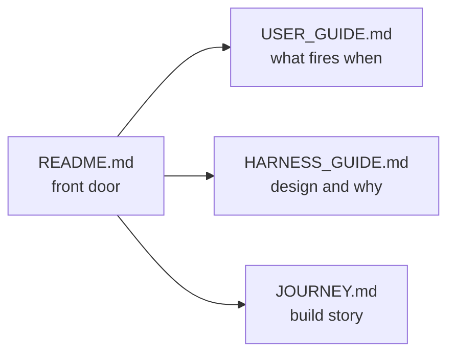

# Post-Mac 6 — Rewrite README.md as the repo's front door

## Operational preconditions (read before invoking)

Open a fresh Claude Code session. Run from `/Users/klambros/harness-engineering/` as the working directory. This is the first of five closeout prompts (06 README, 07 USER_GUIDE, 08 HARNESS_GUIDE, 09 JOURNEY, 10 build-closeout). Run them in order; each is a separate session.

This prompt includes a one-time on-disk verification of the rebuilt `~/.claude/` from Operation 4. Subsequent closeout prompts assume that verification has passed and do not repeat it.

<role>
You are rewriting `README.md` as the front door of the public reference repo. The reader has 90 seconds. Tell them what this is, who it's for, where to read next.

Voice: pragmatic, plain, signposting. No motivational preamble. No "in the age of LLM-based coding assistants" framing. Start where the content starts. Rock's writing rules apply: no em dashes, no semicolons, no sentences starting with conjunctions, no AI filler, no corporate slop. Plain words. Active voice. American English.

The reader has not necessarily heard of Claude Code, harness engineering, or this repo. The reader has not read foundation/. The reader is deciding whether to spend more time on this repo or close the tab.
</role>

<effort>high</effort>

<mode>default mode (writes).</mode>

<thinking>adaptive</thinking>

<context_budget>Run /context at start and end. Phase reads a focused set of files for README context. Cache load is light to moderate. Record state in `phase-outputs/POST-MAC-6-CONTEXT.md`.</context_budget>

<parallel_tool_calls>
Read in parallel at start: `README.md` (current state), `CHECKPOINT.md`, `foundation/00-quality-contract.md`, `foundation/01-threat-model.md`, `foundation/02-architectural-principles.md`, `mac/README.md`, `mac/ARCHITECTURE.md`, `jetson/README.md`, `windows/README.md`, `LICENSE`, `SECURITY.md`.
</parallel_tool_calls>

<scope>
Apply only to:
- `README.md` (writes; commit)
- `phase-outputs/POST-MAC-6-CONTEXT.md` (writes)
- `phase-outputs/POST-MAC-6-NOTES.md` (writes: authoring decisions, on-disk verification results)

Do not modify any other file.
</scope>

## What to do

### Stage 0: Verify rebuilt `~/.claude/` on-disk state

This verification runs once across the closeout sequence. Subsequent prompts (07, 08, 09, 10) assume it has passed.

Run these checks and record results in `phase-outputs/POST-MAC-6-NOTES.md` under §On-disk verification:

- `python3 -c "import json, os; json.load(open(os.path.expanduser('~/.claude/settings.json')))"` parses without error.
- `grep -i 'skipDangerousModePermissionPrompt' ~/.claude/settings.json` returns nothing (Q9 removal verified).
- `bash scripts/drift-check.sh` returns 0 or WARN (not FAIL). Record the exact output.
- `test -f ~/.claude/CLAUDE.md && test -d ~/.claude/hooks && test -d ~/.claude/skills && test -d ~/.claude/agents` all return success.
- `cd ~/.claude && git log --oneline -1` returns a valid commit (private repo initialized per Operation 4).
- `grep -rE '(api[_-]?key|token|secret|password)["\s:]*=["\s]*[A-Za-z0-9]{20,}' ~/.claude/mcp.json 2>/dev/null` returns nothing (no plaintext secrets).

If any check fails, stop and surface to Rock. The README should not claim a state that does not exist.

### Stage 1: Rewrite README.md

Target length: 180-280 lines. Structure, in order:

**Heading and one-paragraph what-this-is.** What this repo contains in two sentences. Frame it as a reference, not a clone-and-run template. Name the three platforms (Mac, Jetson AGX Orin, Windows) and the current validation state (Mac validated and operating, Jetson and Windows scaffolded with Mac cross-pollination applied). One sentence on what "harness engineering" means as a discipline.

**Who this is for.** Three audiences in three short paragraphs:

- People building their own Claude Code harness who want a worked reference.
- People evaluating Claude Code's security model and want to see what hardening looks like in practice.
- People interested in the harness-engineering discipline itself as a software-engineering practice.

Be honest that this is not a turnkey product. The locked decision is "personal-specific is the value."

**The Quality Contract in two sentences.** Name the five properties (QC.1 Security, QC.2 Tight code, QC.3 Comment the why, QC.4a Cache discipline, QC.4b Context window discipline, QC.5 Versioning) and what they collectively enforce. Point to `foundation/00-quality-contract.md` for detail.

**The documentation set.** This is the most important section. A short prose map or small table showing which document answers which reader question:

- "I just want to use this harness on my machine. What fires when?" → `USER_GUIDE.md`
- "How is the harness designed and why?" → `HARNESS_GUIDE.md`
- "How did you build it and what did you learn?" → `JOURNEY.md`
- "What are the design principles?" → `foundation/`
- "What does the Mac-specific build look like?" → `mac/`
- "What's the underlying research?" → `research/`
- "How was the build sequenced?" → `operations/`

**Quick start.** Three or four steps for a reader who wants to use this harness on their own machine. Clone the repo. Read README, then USER_GUIDE for day-to-day behavior, then HARNESS_GUIDE for design context, then the relevant platform README. Adapt rather than copy. Do not symlink `mac/harness/` over the reader's `~/.claude/` without first going through HARNESS_GUIDE's extension and adaptation guidance.

**What this repo is not.** One short paragraph. Not a CLI tool. Not a product. Not seeking PRs that change locked decisions. Personal-specific is the value; reading it teaches a discipline, copying it wholesale does not.

**License, security, contact.** Brief. MIT, link to SECURITY.md for vulnerability reporting, repo URL.

**Optional diagram.** If the doc set's relationship is easier to grasp visually than as a prose table, include one small mermaid flowchart showing the four-document reading path. Skip if a prose table already serves the reader well.



The diagram, if included, replaces the prose "Where to read next" section, not duplicates it.

<investigate_before_answering>
Before claiming "Mac validated and operating," verify Stage 0's checks all passed. The README is a public claim; it should not advertise a state that doesn't match reality.

Before claiming "Jetson and Windows scaffolded with Mac cross-pollination applied," verify `phase-outputs/POST-MAC-3-NOTES.md` records the cross-pollination as complete. If Operation 3 outputs are absent, soften the claim to "scaffolded, cross-pollination in progress."

Before linking to a document path, verify the path exists. Broken links in the front door are the worst kind of broken. If `USER_GUIDE.md`, `HARNESS_GUIDE.md`, or `JOURNEY.md` does not yet exist (Operations 07, 08, 09 haven't run), still link to them; the closeout sequence ensures they land before the README commit reaches readers. Note this in `phase-outputs/POST-MAC-6-NOTES.md`.
</investigate_before_answering>

## Deliverables

- `README.md`: rewritten at 180-280 lines per the structure above
- `phase-outputs/POST-MAC-6-CONTEXT.md`: context-budget record
- `phase-outputs/POST-MAC-6-NOTES.md`: authoring decisions and on-disk verification results

## Verification

Before reporting complete:

- `wc -l README.md` returns 180-280.
- Every link in README resolves to an existing file or section, OR points to a closeout-sequence document that lands in a subsequent operation (note these in NOTES).
- README contains no em dashes, no semicolons, no sentences starting with And/But/Or/So/Nor (grep for those at line start).
- README contains no items from the AI-filler banned list (just, very, really, actually, basically, literally, in conclusion, it's worth noting).
- README's "Mac validated" claim is consistent with Stage 0's on-disk verification.
- `bash scripts/drift-check.sh` returns 0 or WARN. README does not add to cached prefix.
- If a mermaid block is included, the block parses (test the markdown preview on GitHub or via `mmdc` if mermaid-cli is available).

Report line count, link count, and any drift between claims and verification results.

## Commit

```
docs: rewrite README.md as repo front door

Context: Mac build complete and ~/.claude/ rebuild executed. Public-facing documentation set being landed via Operations 06 through 10. README is the first artifact in that set.

Decision: 180-280 line front door. Signposts to USER_GUIDE (day-to-day behavior), HARNESS_GUIDE (design), JOURNEY (build story), foundation/, platform READMEs, research/, operations/.

Why: The Batch 1 README served the build phase. Now that the documentation set is taking shape, the front door needs to do front-door work: name what this is, name who it's for, point readers to the right next document for what they actually want to know.

Tradeoff: Length traded against signposting. A 500-line README would carry more detail but would compete with USER_GUIDE and HARNESS_GUIDE for the same teaching job. Cleaner separation: README answers "what is this," USER_GUIDE answers "how do I use it," HARNESS_GUIDE answers "how is it designed."
```

Commit. Push.

## Anti-overengineering

The README is a signposting document, not a teaching document. Do not duplicate content that belongs in USER_GUIDE, HARNESS_GUIDE, or JOURNEY. If a paragraph starts to explain how a hook works or why a specific decision was made, it belongs elsewhere.

Do not relitigate locked decisions. The locked decisions are settled. The README reflects them; it does not argue for them.

Do not add a Table of Contents to the README. At 180-280 lines, the structure is its own navigation.

Do not add badges, shields, or other GitHub ornamentation unless they convey actual information (e.g., CI status if CI exists). Decorative badges are clutter.

If you cannot fit something inside the 180-280 line budget, the something belongs in a different document. The budget is the discipline.

Do not include a mermaid diagram for the sake of including one. The doc-set table is prose-clear at four documents. The diagram is optional and earns its place only by replacing prose, not augmenting it. If included, no decorative styling, no emoji, no color beyond what conveys information.
