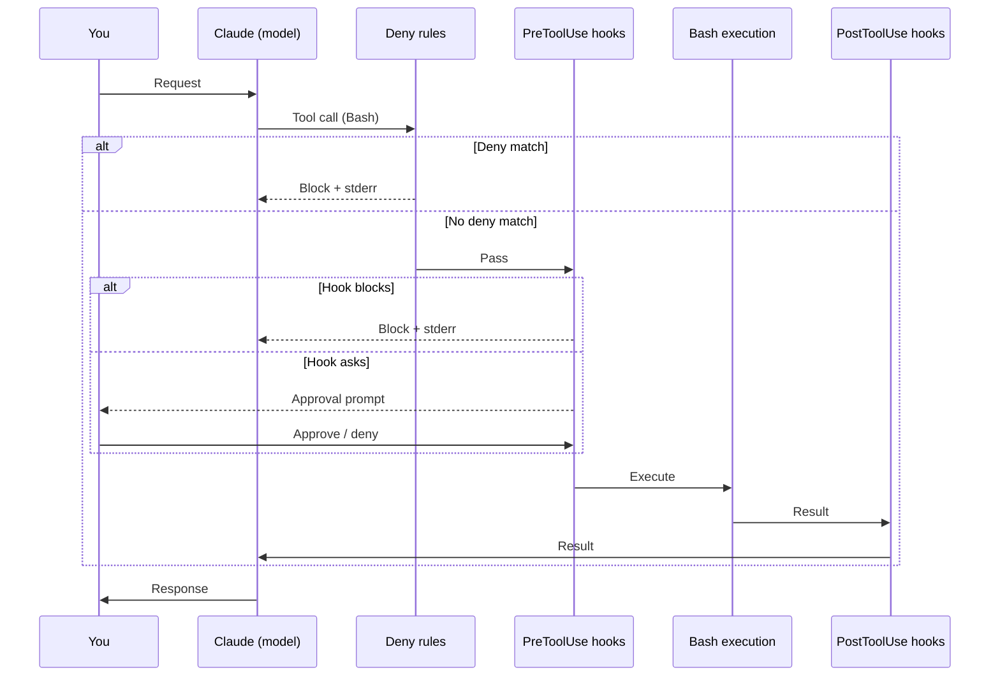

# Post-Mac 7 — Author USER_GUIDE.md as the pragmatic day-to-day guide

## Operational preconditions (read before invoking)

Open a fresh Claude Code session. Run from `/Users/klambros/harness-engineering/` as the working directory. Operation 06 (README rewrite) has committed and the one-time on-disk verification of the rebuilt `~/.claude/` passed. This prompt assumes that state.

<role>
You are authoring `USER_GUIDE.md` as the pragmatic day-to-day user guide. A reader who has installed this harness (or copied parts of it into their own `~/.claude/`) reads this document and walks away knowing: what fires when, what message they see, what to do about it, what workflows benefit, and how to troubleshoot common scenarios.

This is NOT an architectural reference (that's HARNESS_GUIDE). This is NOT a build retrospective (that's JOURNEY). This is the document that answers "I have this harness loaded, what's it actually doing right now, and how do I work with it."

Tone discipline. Pragmatic and immediate. The reader is at their terminal with Claude Code open and wants to understand the behavior they're observing or about to observe. Show concrete commands. Show concrete output. Show the message they will see when a hook fires. Don't abstract.

Voice: second person ("you"). "When you run `sudo ls`, the deny rule fires and you see..." First-person Rock voice belongs in JOURNEY. Third-person architectural voice belongs in HARNESS_GUIDE. USER_GUIDE is "you" doing things and the harness responding.

Rock's writing rules apply: no em dashes, no semicolons, no sentences starting with conjunctions, no AI filler, no corporate slop. Plain words. Active voice. American English. Sentences a reader can quote. Educational means defining terms before using them and showing concrete examples, not motivational warmth.
</role>

<effort>xhigh</effort>

<mode>default mode (writes).</mode>

<thinking>adaptive</thinking>

<context_budget>Run /context at start, after §3, after §6, and at end. Reading load is moderate; the reading focuses on the operational behavior of each harness component rather than the design rationale. Record state in `phase-outputs/POST-MAC-7-CONTEXT.md`.</context_budget>

<parallel_tool_calls>
Initial parallel read: `mac/harness/CLAUDE.md`, `mac/harness/settings.json`, every file in `mac/harness/hooks/`, every file in `mac/harness/rules/`, `mac/harness/skills/mcp-server-pre-trust-audit/SKILL.md`, `mac/harness/skills/seed-evaluation/SKILL.md`, `mac/harness/agents/inventory.md`, `mac/harness/agents/reviewer.md`, `phase-outputs/ANSWERS.md` (the calibrated decisions), `phase-outputs/PHASE-5-AUDIT.md` (for behavior details and known residual risks).
</parallel_tool_calls>

<scope>
Apply only to:
- `USER_GUIDE.md` (writes; new file; commit)
- `phase-outputs/POST-MAC-7-CONTEXT.md` (writes)
- `phase-outputs/POST-MAC-7-NOTES.md` (writes: authoring decisions, behavior gaps surfaced)

Do not modify any other file.
</scope>

## What to do

Target length: 1000-1800 lines. Ten sections. Each section is its own H2. Each subsection within is an H3. Concrete examples preferred over abstract explanation. Tables for reference material. Code blocks for actual commands and outputs.

### §1. Quick orientation

One to two pages. Open with what changes after this harness loads:

- The session is governed by deny rules that block certain Bash commands outright.
- PreToolUse hooks intercept some tool calls (Bash, Write, Edit) and either pass, ask, or block based on what the call would do.
- A SessionStart hook audits the in-repo `.claude/` configuration on every session start.
- A Stop hook prunes session logs older than 90 days.
- Two skills (`mcp-server-pre-trust-audit`, `seed-evaluation`) load when their triggers match.
- Two subagents (`inventory`, `reviewer`) can be spawned via the Task tool.
- The auto-mode classifier is enabled, meaning most safe operations skip permission prompts.

End the section with a one-page table titled "The harness at a glance" listing every active component:

| Component | Kind | When it acts | What it does |
|---|---|---|---|
| (each row enumerated explicitly) | (kind) | (trigger) | (effect, populated by reading the actual files in mac/harness/) |

This table is the reference card. A reader who reads only §1 should be able to recognize every component's behavior.

### §2. What fires when

The longest section. Three to five pages. For each hook, deny rule, skill, and agent, explain in concrete terms what triggers it and what the user observes.

**§2.1 Deny rules** (six rules). For each:

- The pattern that triggers it (e.g., `Bash(git push --force:*)`)
- An example command a user might try
- The behavior the user observes (blocked with stderr, no prompt, just blocked)
- The exact error message text if one exists
- How to legitimately accomplish the underlying task another way (e.g., for `git push --force`, use `git push --force-with-lease` or do the equivalent operation interactively)

Enumerate every rule: `bash-deny-dangerously-skip-permissions`, `bash-deny-git-push-force`, `bash-deny-rm-rf-root`, `bash-deny-sudo`, `filesystem-deny-write-secrets`, `mcp-deny-server-prefix-default`.

**§2.2 PreToolUse hooks** (four hooks). For each:

- What event triggers the hook
- What the hook inspects in the tool input
- What conditions cause it to ask (return exit-code-1) vs block (exit-code-2) vs pass
- Example command that triggers asking
- Example command that triggers blocking
- The exact stderr message the user sees in each case
- How to override or work around when the hook's calibration is wrong for a specific case

Enumerate: `PreToolUse-bash-cap-subcommands.py` (30-subcommand cap), `PreToolUse-cached-prefix-write-gate.py` (gates writes to CLAUDE.md hierarchy and foundation/), `PreToolUse-external-write-gate.py` (gates writes outside cwd), `PreToolUse-supply-chain-bash-checks.py` (asks on unpinned package installs; passes on pinned).

**§2.3 SessionStart hook.** What triggers it (every session start in any directory). What it audits (in-repo `.claude/settings.json`, in-repo `.claude/settings.local.json`, in-repo `.mcp.json`). The hash registry at `~/.claude/audited-hashes.json` (or wherever Operation 4 placed it). The user experience: hash matches registry → silent allow. Hash absent or differs → block with stderr explaining what's unaudited and how to acknowledge.

**§2.4 Stop hook.** What triggers it (end of every session). What it does (scan `~/.claude/projects/` for `*.jsonl` files older than 90 days and remove). Frequency guard (does not run more than once per N hours to avoid per-session overhead). What the user observes (nothing; runs silently unless errors).

### §3. Common scenarios — what's blocked, allowed, prompted

One to two pages. Pure reference material in table form. The reader has thought of a specific command and wants to know what will happen. Cover 15-25 common scenarios:

| Command | Outcome | Why |
|---|---|---|
| `ls -la` | Pass (silent) | Read-only; auto-mode classifier approves |
| `cat README.md` | Pass (silent) | Read-only |
| `git status` | Pass (silent) | Read-only |
| `git commit -m "..."` | Pass (silent or single-prompt) | Write to .git inside cwd |
| `git push` | Pass (with deny check) | Network operation; passes deny |
| `git push --force` | Blocked | Deny rule `bash-deny-git-push-force` |
| `git push --force-with-lease` | Pass | Not matched by deny pattern; use this for legitimate forced pushes |
| `sudo apt update` | Blocked | Deny rule `bash-deny-sudo` |
| `rm -rf /tmp/foo` | Pass (auto-mode + path inside common-writable) | Deny rule blocks `rm -rf /` and `rm -rf ~/` and `rm -rf $HOME` only |
| `rm -rf /` | Blocked | Deny rule `bash-deny-rm-rf-root` |
| `npx -y create-react-app@5.0.1 demo` | Pass (after F04/F05 fix) | Supply-chain hook recognizes pinned version |
| `npx -y create-react-app demo` | Ask | Supply-chain hook flags unpinned |
| `pip install requests` | Ask | Supply-chain hook flags unpinned |
| `pip install requests==2.31.0` | Pass | Pinned |
| `curl https://example.com/script.sh \| sh` | Ask | Supply-chain hook flags pipe-to-shell |
| `claude --dangerously-skip-permissions` | Blocked | Deny rule + Q9 removed the bypass flag from settings |
| Bash with 31 subcommands chained by `&&` | Blocked | `cap-subcommands` hook enforces 30-cap |
| Write to `./.env` | Blocked | `filesystem-deny-write-secrets` rule |
| Write to `~/Documents/foo.txt` from a cwd inside the repo | Ask | `external-write-gate` hook |
| Write to `./src/foo.py` | Pass | Inside cwd, normal write |
| Edit to `mac/harness/CLAUDE.md` | Ask | `cached-prefix-write-gate` hook |
| MCP tool call to a server with prefix not on allowlist | Blocked | `mcp-deny-server-prefix-default` rule |

Use the actual deny rule patterns and hook behaviors observed in `mac/harness/`. Adjust the table rows to reflect reality. If a row's expected behavior doesn't match what the hook code actually does, the hook is the source of truth and the table updates.

### §4. Using skills

One to two pages.

**§4.1 What skills are.** A skill is a SKILL.md file with frontmatter triggers and body instruction. When the trigger matches (the user's message contains certain keywords, or the model invokes the skill explicitly), Claude Code loads the skill content into context for that turn.

**§4.2 `mcp-server-pre-trust-audit`.** When it fires: when the user asks Claude Code to "audit this MCP server before I trust it" or similar phrasing matching the skill's triggers. What it does: applies the pre-trust audit pattern (verify package source, check maintainership, verify signatures if any, audit the manifest's tool list, check for plaintext secrets). Sample invocation. Sample output.

**§4.3 `seed-evaluation`.** When it fires: when the user asks Claude Code to evaluate a candidate tool (skill, plugin, MCP server) for adoption. What it does: applies the pre-filter then deep-eval methodology from `foundation/03-seed-evaluation-methodology.md`. Sample invocation. Sample output.

**§4.4 Triggering skills manually.** If the natural trigger doesn't fire, the user can invoke a skill explicitly by name in their prompt. Show the syntax.

### §5. Using subagents

One to two pages.

**§5.1 What subagents are.** A subagent is a separate Claude Code reasoning track spawned via the Task tool. The main session passes a prompt; the subagent runs to completion and returns a result. Same-family parent/subagent cache lineage applies (QC.4a).

**§5.2 `inventory` agent.** When it's typically used (Phase 1 of any harness build; whenever Rock needs to scan a wide surface of files without burning main-session context on the scan). How to spawn it (Task tool with the agent's path). Sample invocation. What it returns.

**§5.3 `reviewer` agent.** When it's typically used (Phase 5 wire-and-document; any time Rock wants an independent audit of work he just produced). The Writer/Reviewer pattern. Sample invocation.

**§5.4 Spawning subagents in your own workflow.** When you might want a subagent. The cost-benefit. Cache lineage discipline.

### §6. Workflows that benefit from this harness

Two to three pages. Each subsection is a workflow scenario, with concrete steps showing what the harness does at each step.

**§6.1 Cloning a new repo with a `.claude/` config.** Step by step: clone, open Claude Code in the new directory, SessionStart hook fires, hash check happens, audit-and-acknowledge flow, then normal session begins.

**§6.2 Adopting a new MCP server.** Step by step: research the server, invoke `mcp-server-pre-trust-audit` skill, evaluate audit output, add to allowlist, test in isolated session, adopt to daily-driver.

**§6.3 Adding a new dependency to a project.** Step by step: try `npm install some-package`, supply-chain hook flags unpinned, switch to pinned form, proceed.

**§6.4 Editing a CLAUDE.md file.** Step by step: edit attempt, cached-prefix-write-gate hook asks, user confirms intentional change, edit proceeds. Why this exists.

**§6.5 Running drift-check before commit.** Step by step: stage changes, run `bash scripts/drift-check.sh`, interpret output, commit.

**§6.6 Reviewing a session's audit log.** Where logs live (`~/.claude/projects/<encoded-cwd>/<session-uuid>.jsonl`). What's in them. How to find a specific session's log. Privacy implications.

### §7. Troubleshooting

One to two pages. Common scenarios where the harness's behavior might confuse a user.

- "The supply-chain hook is asking me about a pinned install." Likely the regex doesn't recognize the pin pattern. Show how to verify and override.
- "The SessionStart hook is blocking me when I clone a new repo." Expected. Show the acknowledge flow.
- "I want to do a legitimate force push." Use `--force-with-lease`. Why `--force` is blocked.
- "Auto-mode is asking too often." Explain auto-mode classifier's false-positive rate. Tuning options.
- "Auto-mode is approving things I'd rather see." Tightening options.
- "I'm hitting the 30-subcommand cap on a legitimate chain." Split the chain. Why the cap is calibrated at 30.
- "A skill that should be firing isn't." Check trigger phrasing. Invoke explicitly.
- "Drift-check is reporting WARN but I haven't added anything." Likely user-level CLAUDE.md grew. Show how to investigate.
- "The Stop hook didn't prune old session logs." Frequency guard may have suppressed it. Show how to force-run.

### §8. Customizing friction

One page. The harness's defaults are calibrated for Rock's daily-driver workload. Other workloads may want different calibrations. Show where to tune:

- Auto-mode on/off (`defaultMode` in settings.json).
- Subcommand cap raising or lowering.
- Adding or removing deny patterns.
- Skill trigger keyword expansion.
- SessionStart audit cadence (every-clone vs periodic).

For each tuning point, show the file to edit, the line or key, and the tradeoff. Cite the Phase 2 answer that calibrated the default.

### §9. Tips and prompting patterns

One page. Short list of prompts and prompt patterns that work well with this harness:

- "Audit this MCP server before I trust it." Triggers `mcp-server-pre-trust-audit`.
- "Evaluate <tool> as a candidate." Triggers `seed-evaluation`.
- "Spawn an inventory agent to scan <area>." Spawns subagent.
- "Spawn a reviewer agent on this work." Spawns subagent.
- "Run drift-check." Reminds Claude Code to run the script.

### §10. What to do when something feels off

Half a page. The honest "tell Rock" guidance. If a hook fires when it shouldn't, or doesn't fire when it should, the calibration may be wrong for your workload. The harness is meant to be adapted; report the false-positive or false-negative and either tune locally or flag in the repo's issues for discussion.

Mention the three residual-risk findings (F09 SessionStart exit-2 semantics, F10 cached-prefix-write-gate scope, F11 glob dialect verification) as known calibration ceilings. The post-launch revision model is how those get tightened over time.

<investigate_before_answering>
Before describing what a hook returns or what error message a user sees, read the hook's actual code. The hook implementations are the source of truth, not the prompt's description of them.

Before listing a deny rule's pattern, read `mac/harness/rules/<rule>.md` and `mac/harness/settings.json`'s deny array. The pattern in settings.json is what Claude Code evaluates.

Before recommending an override or workaround, verify the override actually works against the hook's logic. A workaround that's technically blocked is worse than no workaround.

Before claiming a skill triggers on certain phrasing, read the skill's SKILL.md frontmatter. The frontmatter defines the triggers; speculation does not.
</investigate_before_answering>

## Mermaid diagrams

Four required, two optional. Diagrams render inline on GitHub via fenced ```mermaid code blocks. Embed each at the relevant section, not in a centralized appendix. Each diagram earns its place only by clarifying a sequence, decision, or hierarchy that prose forces the reader to mentally lay out.

**Required: Sequence diagram — "What happens when you run a Bash command."** Embed in §2 or §3. Participants: you, Claude (the model), the deny check, the PreToolUse hooks, the Bash execution layer, the PostToolUse hooks. Show the path of a normal allowed call AND the divergence when a deny rule blocks or a hook asks. Suggested skeleton, adapt the participant names and message text to match observed behavior:



**Required: Flowchart — SessionStart audit decision.** Embed in §2.3. Inputs: session opens in some directory. Outputs: silent allow, block-with-acknowledge, or hard block.

**Required: Flowchart — Supply-chain hook decision.** Embed in §2.2. Inputs: a Bash invocation matching a package-install pattern. Outputs: pass silently (pinned), ask (unpinned), block (malformed).

**Required: Flowchart — External-write-gate decision.** Embed in §2.2. Inputs: a Write or Edit tool call. Outputs: pass (inside cwd), ask (outside cwd in additionalDirectories), block (outside both).

**Optional: Sequence diagram — Subagent spawning.** Embed in §5. Shows Task tool invocation, subagent spinup, cache lineage, and return to parent.

**Optional: Flowchart — Adopting a new MCP server workflow.** Embed in §6.2. Steps from "I want to adopt X" through pre-trust audit, allowlist entry, isolated test, daily-driver adoption.

Skip an optional diagram if the section is short enough that the prose already serves the reader.

## Deliverables

- `USER_GUIDE.md`: 1000-1800 lines, ten sections, pragmatic day-to-day reference
- `phase-outputs/POST-MAC-7-CONTEXT.md`: context-budget record
- `phase-outputs/POST-MAC-7-NOTES.md`: authoring decisions, any behavior gap surfaced between hook code and the guide's description

## Verification

Before reporting complete:

- `wc -l USER_GUIDE.md` returns 1000-1800.
- Every cited file path resolves. Every cited error message exists in the hook's code or matches the documented behavior.
- Every entry in the §1 "harness at a glance" table corresponds to a real file in `mac/harness/`.
- Every entry in the §3 scenarios table is consistent with the actual hook and rule behavior.
- USER_GUIDE contains no em dashes, no semicolons, no sentences starting with And/But/Or/So/Nor at line start.
- USER_GUIDE contains no AI-filler banned words.
- USER_GUIDE contains no corporate-slop banned words.
- `bash scripts/drift-check.sh` returns 0 or WARN. USER_GUIDE does not add to cached prefix.
- All mermaid blocks parse. Each block's nodes use plain labels (no decorative emoji, no styling beyond what conveys information). No flowchart exceeds 12 nodes. No sequence diagram exceeds 8 lifelines.

Report line count, scenario count in §3, citation count back to actual harness files, diagram count and types (sequence vs flowchart), and any behavior discrepancies caught (hook code vs documented behavior).

## Commit

```
docs: add USER_GUIDE.md as the pragmatic day-to-day guide

Context: HARNESS_GUIDE answers "how is this designed." USER_GUIDE answers "I have this harness loaded, what's it doing right now, what do I see, what do I type." Operation 07 introduces this artifact and closes the gap surfaced by Rock: the design-focused guide left readers without concrete operational guidance.

Decision: 1000-1800 line pragmatic reference. Ten sections covering: quick orientation; what fires when (per-component behavior); common scenarios as a reference table; using skills; using subagents; workflows; troubleshooting; customizing friction; tips and prompting patterns; what to do when something feels off.

Why: A reference repo without a pragmatic user guide leaves readers either reverse-engineering behavior from code or guessing. USER_GUIDE makes the harness's operational surface inspectable without reading every hook script.

Tradeoff: Some content overlaps with HARNESS_GUIDE (both reference the same files). The split is by angle: USER_GUIDE describes what you observe and do; HARNESS_GUIDE describes why the design is what it is. Two audiences, two documents.
```

Commit. Push.

## Anti-overengineering

Do not invent behavior. If the hook code does X, USER_GUIDE says X. If the prompt's description disagrees with the code, the code wins and USER_GUIDE follows the code. Flag the discrepancy in NOTES.

Do not describe behavior in terms of design rationale ("the threat model dictates that..."). That belongs in HARNESS_GUIDE. USER_GUIDE describes the observed behavior with at most a one-sentence "because..." pointer to HARNESS_GUIDE for the deeper why.

Do not write USER_GUIDE in third-person architectural voice. The reader is at their terminal; the voice is "you." Second-person throughout.

Do not soften the document with motivational language. "Welcome to your harness journey," "you've got this," "let's dive in" all violate the writing rules and the audience contract. The reader is technically competent; treat them that way.

If a section's content is identical to HARNESS_GUIDE's equivalent section, the documents are not split correctly. Stop and surface to NOTES. USER_GUIDE and HARNESS_GUIDE should be complementary, not duplicative.

If a hook's behavior is more complex than the section budget allows, summarize the common case and refer to HARNESS_GUIDE for the edge cases. Don't try to fit every nuance into USER_GUIDE.

Mermaid discipline. No diagram unless prose alone forces the reader to do layout work; decorative diagrams are clutter. Mermaid sources use plain labels: no emoji, no decorative styling, no color beyond what conveys information. Captions and surrounding prose follow the writing rules. Cap complexity: roughly 12 nodes per flowchart, roughly 8 lifelines per sequence. Beyond that, split into two diagrams or convert to a table.
