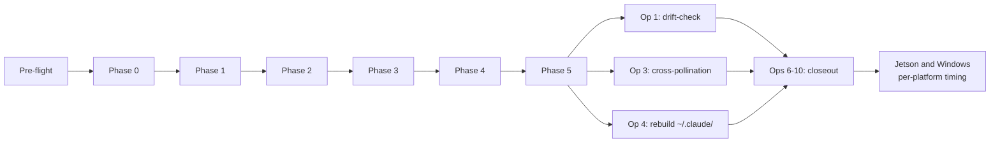

# Post-Mac 9 — Deep rewrite of JOURNEY.md as educational narrative

## Operational preconditions (read before invoking)

Open a fresh Claude Code session. Run from `/Users/klambros/harness-engineering/` as the working directory. Operations 06 (README), 07 (USER_GUIDE), and 08 (HARNESS_GUIDE) have committed. This prompt assumes the on-disk verification from Operation 06 passed.

This prompt produces `JOURNEY.md` as a markdown file. The previous scaffold lived at `JOURNEY.ipynb`. The notebook format is being retired (format-consistency decision; .md unifies the documentation set). The .ipynb file gets deleted as part of this operation; its content is replaced by JOURNEY.md.

<role>
You are authoring `JOURNEY.md` as the educational narrative companion to the structural documentation. JOURNEY tells the story of how the harness got built: what was tried, what worked, what surprised, what would be different next time.

Voice: first-person, Rock's exec voice. Bayesian framing where appropriate (treating beliefs as updateable, naming probabilities rather than certainties when the evidence merits it). Rock's writing rules apply: no em dashes, no semicolons, no sentences starting with conjunctions, no AI filler, no corporate slop. Plain words. Active voice. American English.

You are drafting. Rock owns the final voice. Where you cannot write authentically as Rock from the evidence available, leave a `<!-- ROCK: confirm or rewrite -->` marker rather than producing pseudo-Rock prose. Examples of where to leave markers: subjective surprise reactions, retrospective regrets framed in first person, value judgments on specific tools or vendors. The phase outputs record decisions and findings; Rock's voice records how he felt about them.

The model is a builder's retrospective written for other builders. Not a corporate post-mortem. Not a sales narrative. Not a polished case study. Honest about what didn't work alongside what did.
</role>

<effort>xhigh</effort>

<mode>default mode (writes).</mode>

<thinking>adaptive</thinking>

<context_budget>Run /context at start, after Phase 0-2 sections, after Phase 3-5 sections, after operations sections, and at end. The phase outputs are the primary source material. Record state in `phase-outputs/POST-MAC-9-CONTEXT.md`.</context_budget>

<parallel_tool_calls>
Initial parallel read: `JOURNEY.ipynb` (the scaffold being retired), `phase-outputs/PREFLIGHT.md`, `phase-outputs/PHASE-0-DECISIONS.md`, `phase-outputs/INVENTORY.md`, `phase-outputs/CONFLICTS.md`, `phase-outputs/QUESTIONS.md`, `phase-outputs/ANSWERS.md`, `phase-outputs/PHASE-3-NOTES.md`, `phase-outputs/PHASE-4-NOTES.md`, `phase-outputs/PHASE-5-AUDIT.md`, `phase-outputs/POST-MAC-1-NOTES.md`, `phase-outputs/POST-MAC-3-NOTES.md`, `phase-outputs/POST-MAC-4-PLAN.md`, `phase-outputs/POST-MAC-4-VERIFICATION.md`.
</parallel_tool_calls>

<scope>
Apply only to:
- `JOURNEY.md` (writes; new file)
- `JOURNEY.ipynb` (delete; the scaffold being retired)
- `phase-outputs/POST-MAC-9-CONTEXT.md` (writes)
- `phase-outputs/POST-MAC-9-NOTES.md` (writes: section-by-section authoring decisions, every Rock-marker placed, every audit finding that informed a surprise or tradeoff)

Do not modify any other file.
</scope>

## What to do

Target: 1500-2500 lines. Structured by section, not by notebook cells. Each phase has its own H2 section; within each phase, H3 subsections cover context, narrative, surprises, tradeoffs, retrospective.

Approximate section budget:

- Prologue: 4-5 H3 subsections under one H2 (~200 lines)
- Pre-flight: 1 H2 (~50 lines)
- Phase 0: 1 H2 with 4-5 H3s (~150 lines)
- Phase 1: 1 H2 with 4-5 H3s (~150 lines)
- Phase 2: 1 H2 with 5-6 H3s (~250 lines)
- Phase 3: 1 H2 with 4-5 H3s (~200 lines)
- Phase 4: 1 H2 with 3-4 H3s (~100 lines)
- Phase 5: 1 H2 with 5-6 H3s (~250 lines)
- Operations: 1 H2 with 3-5 H3s (~200 lines)
- Verification snapshot: 1 H2 with code-block examples (~100 lines)
- Epilogue: 1 H2 with 4 H3s (~200 lines)
- Post-launch revisions: 1 H2 (~50 lines)

Per-phase H3s follow a consistent shape:

- **Context.** What the phase was for, what the prompt asked for.
- **Narrative.** What happened. The concrete events.
- **Surprises.** What didn't go as expected. Cite specific findings or reframings.
- **Tradeoffs.** The decisions that turned on a tradeoff. Name the alternative not taken.
- **Retrospective.** What I would do differently. Tie to specific audit findings.

Not every phase needs all five; some merge naturally. The budget is a guide, not a hard count.

### Prologue (H2: "Why I built this and how to read this")

Four to five H3 subsections.

**§"The problem."** First-person setup. Claude Code's default permissive posture. Three machines with credentials and push access. The cost of one mistake. Anchor in concrete things: the plaintext API token found in Phase 1, the 56 dangling symlinks, the 4311 unpruned session logs.

**§"The question."** What would it take to harness Claude Code with security discipline without sacrificing the usefulness that made me adopt it.

**§"The commitment."** Build it in public so others can read the reasoning, not just the outputs. The locked decision: personal-specific is the value.

**§"What this document is and isn't."** Not a tutorial. Not a postmortem. The notebook is the reasoning chain that produced the rest of the repo. Each phase has its own section with a consistent structure: context, narrative, surprises, tradeoffs, retrospective. Where I left a `<!-- ROCK: confirm or rewrite -->` marker, the executing session was unsure and Rock made the call.

**§"How to read this alongside the repo."** Pointer to README for the front door, to USER_GUIDE for day-to-day operational behavior, to HARNESS_GUIDE for the design reference, to foundation/ for the principles. JOURNEY is the story; the other documents are the structure.

### Pre-flight (H2: "Pre-flight")

One H2, prose. What the three research documents are (Liu et al. on Claude Code v2.1.88, SAGE on harness engineering as a discipline, NIST SP 800-218 on secure development). What SAGE settled. Why the build was structured around shared foundation plus three platform sections.

### Phase 0 (H2: "Phase 0: goals and architecture")

Four to five H3s. Content:

- Context: what Phase 0 was for (environment baseline, decisions driving Phase 2 questions, settling which `<TBD-PHASE-0>` blocks resolve vs defer).
- Narrative: what happened. macOS 26.3, Node 24.10, Python 3.13.9, Claude Code v2.1.138, the SuperClaude framework already in place at user level adding 16.6k tokens. The cache-lineage decision (Opus parent / Opus subagent). The cost-cache tradeoff named openly.
- Surprises: the user-level CLAUDE.md hierarchy was 5.7x larger than the project's. The prompt-authoring inconsistency PHASE-0-DECISIONS caught (settings.json.template TBD markers out of Phase 0's scope). The Anaconda Python's broken semgrep install.
- Tradeoffs: Opus everywhere (cache economy) vs mixing Sonnet for routine subagents (cost economy). Brewfile.lock vs direct pins (chose deferred). Network egress monitor evaluation (deferred to Phase 4, eventually skipped).
- Retrospective: prompt-authoring inconsistency. Verification grep over-broadness (`<TBD-PHASE-0>` grep counted prose references to the marker as remaining work).

### Phase 1 (H2: "Phase 1: discovery")

Four to five H3s. The 44 in-repo `.claude/` directories found. The plaintext Hetzner API token. The 16-plugin enabledPlugins list. The 4311 session logs. The seed pre-filter surface. Surprise: Q5 (every-clone hash-gated audit) became materially more expensive than expected given the backlog. Tradeoff: pre-trust audit cadence vs operational friction.

### Phase 2 (H2: "Phase 2: architecture interview")

Five to six H3s. The densest phase because it's where the calibrated decisions landed.

- Context: the AskUserQuestion interview format, the goal of recording the rationale alongside each answer.
- Narrative: walk through the 11 questions briefly. Q1 auto-mode classifier enabled, Q2a T2+T5, Q2b T3, Q3 rebuild entire `~/.claude/` beyond planned options, Q4-Q11 shorter.
- Surprises: Q3 reframed mid-interview by Rock's clarification. Q2a needed clarification before Rock could choose; original options forced a security-vs-friction tradeoff he wanted help calibrating. The agentcontrolstandard.ai future swap-in candidate surfaced through Q8.
- Tradeoffs: auto-mode on (Q1) traded 0.4% false-positive rate for daily-driver friction reduction. 30-subcommand cap (Q6) traded operational ceiling for defense in depth below the 50-bypass class. Rebuilding entire `~/.claude/` (Q3) traded build effort for clean operational baseline.
- Retrospective: Q3 option set was too narrow. Right framing surfaced through Rock's clarification. Future architecture interviews should include an "other" option with structured follow-up.

### Phase 3 (H2: "Phase 3: deterministic layer")

Four to five H3s. Six hooks, six deny rules, settings.json populated. Surprise: the supply-chain hook regex (F04, F05) was structurally broken for pinned `uvx --from git+...@<ref>` and pinned `npx -y <pkg>@<version>`. Honest write-up: greedy match consumed URL, negative lookahead scanned past pin, ordinary pinned installs false-positived as unpinned. Two-step rewrite (regex extracts, Python validates) fixed it. The cached-prefix-write-gate's deliberately narrow scope (Q2a T5).

### Phase 4 (H2: "Phase 4: extension layer")

Three to four H3s. Two skills, two agents adopted. Smaller than seed pre-filter implied. Superpowers v5.1.0 skill count was 14, not the 17 INVENTORY claimed (F08). Tradeoff: lean adoption with documented swap-in paths vs broader adoption with more cache-prefix footprint.

### Phase 5 (H2: "Phase 5: wire and document")

Five to six H3s. The Writer/Reviewer subagent pattern. 13 findings. Blocker F01 was the audit log itself missing as a deliverable; prompt's own verification grep depended on a file the prompt did not yet require be produced. The two regex bugs from Phase 3 caught here. Three accept-residual-risk findings (F09, F10, F11) with their named post-launch triggers. "READY with majors recorded," not READY clean.

### Operations (H2: "Operations: post-execution work")

Three to five H3s. Why operations weren't part of the original phase plan: the Mac build's phase sequence settled the structural artifacts; operations land what those artifacts produced into the operational environment and propagate learnings.

- Operation 1: drift-check widening. Closed the Phase 2 Q10 commitment that no phase prompt named.
- Operation 3: cross-pollination into Jetson and Windows scaffolds.
- Operation 4: the destructive rebuild of `~/.claude/`. Biggest single act of the build. Default-keep posture settled through Socratic walkthrough with Rock. The four non-negotiables (plaintext secrets, skipDangerousModePermissionPrompt, dangling symlinks, expired session logs). §Files to classify concern-flagged surface. Single confirmation gate. Byte-identical preservation discipline.
- Optional H3 on Operations 06-10 (this closeout sequence) as the documentation-deliverables wave that turned the private build into a public-facing reference. Mention the consolidated-mega-prompt to per-deliverable-prompts shift, and the late USER_GUIDE addition that closed Rock's "no idea what this is doing" gap.

### Verification snapshot (H2: "Repo state verification")

One H2 with markdown code blocks showing the commands a reader can run to verify repo state. These are not executable from within the .md file (no notebook cells), but documented for the reader to copy and run:

````
# Combined CLAUDE.md hierarchy line count under target
bash scripts/drift-check.sh

# Foundation documents stay short and focused
wc -l foundation/*.md

# Mac build commit sequence
git log --oneline -20 -- mac/

# Operations directory state
ls -la operations/
````

Brief prose explaining what each command tells the reader.

### Epilogue (H2: "What I learned and what's next")

Four H3s.

**§"What I learned about Claude Code as a build target."** Honest assessment. What worked (AskUserQuestion interview format, Writer/Reviewer pattern, explicit cache-lineage discipline). What didn't (Phase 5 prompt's circular verification dependency, supply-chain hook regex assumed without testing). What surprised me about Opus 4.7 as a build executor (literalism on scope, parallel-tool-call efficiency, tendency to over-emphasize when prompts did).

**§"What I learned about harness engineering as a discipline."** How the Quality Contract held up under real building. Whether the threat model's six threats were the right framing or whether I'd reorganize next time. Drift between expected and validated findings.

**§"What comes next."** Jetson execution. Windows execution. Continuous-revision operational model. Residual-risk findings carrying their reconsideration triggers. agentcontrolstandard.ai swap-in candidate. The repo is born public; revisions land as the harness evolves.

**§"How to engage."** Brief: this is a personal reference repo. Issues and discussion welcome; PRs that change locked decisions are not. Forks adapting for other threat models are exactly the intended use.

### Post-launch revisions (H2: "Post-launch revisions")

One H2. Operations 06-10 were the last operations in the original build sequence; everything after is post-launch revision. Format: each significant revision lands as its own H3 with date, the change, and the threat or assumption it addressed. The full commit log is the source of truth; this section is the curated narrative.

## Mermaid diagrams

Two or three diagrams, all optional. Diagrams render inline on GitHub via fenced ```mermaid code blocks. JOURNEY is narrative-first; diagrams earn their place only where the story has structural shape that prose forces the reader to mentally lay out.

**Optional: Timeline — Build sequence.** Embed in the operations section or epilogue. Show the temporal flow: Pre-flight → Phase 0 → 1 → 2 → 3 → 4 → 5 → Operations 1, 3, 4 → Operations 6-10 (closeout). Suggested form:



**Optional: Tree — Operation 4 §Files classification.** Embed in the Operations section. Show the five §Files sections of the Operation 4 plan as branches: §Files to write new, §Files to modify, §Files to delete, §Files to classify, §Files to preserve. Include only if the section's prose feels dense without it.

**Optional: Sequence diagram — Writer/Reviewer pattern.** Embed in the Phase 5 section. Show writer subagent producing output, reviewer subagent auditing, dispositions (fix-now / accept-residual-risk / accept). Include only if the Phase 5 narrative reads better with a visual than without.

Skip any diagram whose narrative reads cleanly as prose. JOURNEY is a story, not a reference manual.

<investigate_before_answering>
Before writing a "surprise" into a phase section, cite the specific phase output and section where the surprise is recorded. Surprises pulled from your own assumptions are not evidence.

Before writing "what I would do differently" for a phase, tie each item to a specific Phase 5 audit finding or PHASE-0-DECISIONS scope inconsistency. Speculation without an audit trail does not belong in JOURNEY.

Before placing a `<!-- ROCK: confirm or rewrite -->` marker, ask whether the phase outputs actually carry the perspective. If they do, draft from them; if they don't, marker is correct.

Before any section claims a specific number (44 in-repo directories, 4311 session logs, 16.6k tokens, etc.), verify the number against the phase output that recorded it.
</investigate_before_answering>

## Deliverables

- `JOURNEY.md`: 1500-2500 line educational narrative with story arc, Rock-markers where Rock's voice is needed
- `JOURNEY.ipynb`: deleted (the scaffold being retired)
- `phase-outputs/POST-MAC-9-CONTEXT.md`: context-budget record
- `phase-outputs/POST-MAC-9-NOTES.md`: section-by-section authoring decisions, Rock-marker count, audit findings cited

## Verification

Before reporting complete:

- `test -f JOURNEY.md && ! test -f JOURNEY.ipynb` returns success (new file exists, scaffold removed).
- `wc -l JOURNEY.md` returns 1500-2500.
- Every prologue, pre-flight, phase, operations, verification, epilogue, and post-launch section is present.
- `grep -c '<!-- ROCK:' JOURNEY.md` returns the count of Rock-markers placed; report in NOTES.
- No em dashes, no semicolons, no sentences starting with And/But/Or/So/Nor at the start of any section.
- No AI-filler banned words.
- No corporate-slop banned words.
- The verification snapshot section's code blocks reference current commands (drift-check, not the raw find).
- `bash scripts/drift-check.sh` returns 0 or WARN. JOURNEY.md does not contribute to cached prefix.
- If any mermaid block is included, the block parses. Each block's nodes use plain labels. No flowchart exceeds 12 nodes; no sequence diagram exceeds 8 lifelines.

Report line count, section count, Rock-marker count, citation count back to phase outputs, diagram count (zero, one, two, or three) with types, and any voice drift caught and fixed.

## Commit

```
docs: replace JOURNEY.ipynb scaffold with JOURNEY.md educational narrative

Context: Original JOURNEY was a Batch 1 scaffold in .ipynb format with six phase cells saying "not yet started." Mac build executed but no phase prompt named JOURNEY as a deliverable, so the notebook sat at scaffold state while the rest of the repo shipped. Format-consistency review (Rock surfaced) determined the .ipynb format split the documentation maintenance story for marginal verification benefit. Operation 09 retires .ipynb and produces JOURNEY.md.

Decision: 1500-2500 line educational narrative in markdown. Sections cover: prologue (why, what this is, how to read), per-phase (context, narrative, surprises, tradeoffs, retrospective), operations (post-execution work), verification snapshot (commands a reader can run), epilogue (lessons, what's next), post-launch revisions.

Why: A repo whose narrative companion is "not yet started" reads as incomplete. The build's reasoning chain is the artifact's primary value per the locked decision; JOURNEY is where that reasoning lives in first-person form. Rock's voice owns the narrative; the executing session drafts where Rock's perspective is needed and leaves <!-- ROCK --> markers for confirmation.

Tradeoff: Length up from 13 cells to ~2000 lines. The document becomes substantial reading. Mitigation: each phase's sections are sectioned consistently (context, narrative, surprises, tradeoffs, retrospective), so readers can skip to the section they need within a phase. The .ipynb-to-.md format change loses runnable verification cells; the verification snapshot section preserves the same commands as copy-paste reference.
```

Commit. Push.

## Anti-overengineering

Do not invent narrative. Pull from phase outputs. Where Rock's voice or perspective is needed and the phase outputs do not carry it, leave a marker.

Do not rewrite the prologue or pre-flight content in ways that lose the anchor points the scaffold established. The "why I built this" framing carries forward; refresh and expand, do not replace.

Do not write JOURNEY in third-person or analyst voice. The narrative is first-person Rock voice. Where you cannot draft authentically, marker rather than pseudo-Rock prose.

Do not produce more than four short paragraphs per H3 subsection. Long subsections lose readers. Break content into multiple H3s if needed.

Do not preserve the JOURNEY.ipynb file. The format change is deliberate; keeping both creates a stale scaffold.

If during authoring you find a finding the phase outputs do not record (an event that happened but was not written down), do not invent details. Flag in NOTES as a gap and either ask Rock or leave a placeholder marker. The narrative is the reasoning chain; reasoning that was never recorded should not be retroactively manufactured.

Mermaid discipline. JOURNEY is narrative-first. No diagram unless the story's structural shape forces the reader to mentally lay out a sequence, decision, or hierarchy. Decorative diagrams break the narrative voice. Mermaid sources use plain labels: no emoji, no decorative styling, no color beyond what conveys information. Cap complexity: roughly 12 nodes per flowchart, roughly 8 lifelines per sequence.
